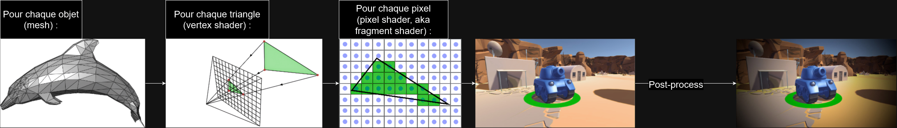

import YoutubeVideo from "/src/components/YoutubeVideo"

Voici une vue d'ensemble de tout ce qui se passe dans Unreal :

Pour faire plus simple, voici ce qu'il faut retenir sur les bases du rendu 3D en rasterisation :

Que vous pouvez retrouver expliquées dans cette super vidéo :
<YoutubeVideo id="C8YtdC8mxTU"/>