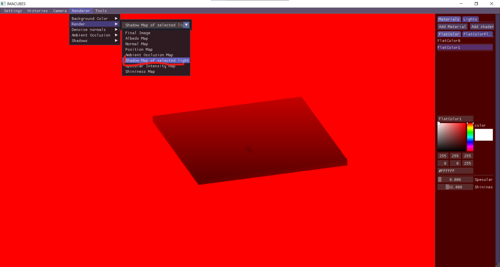
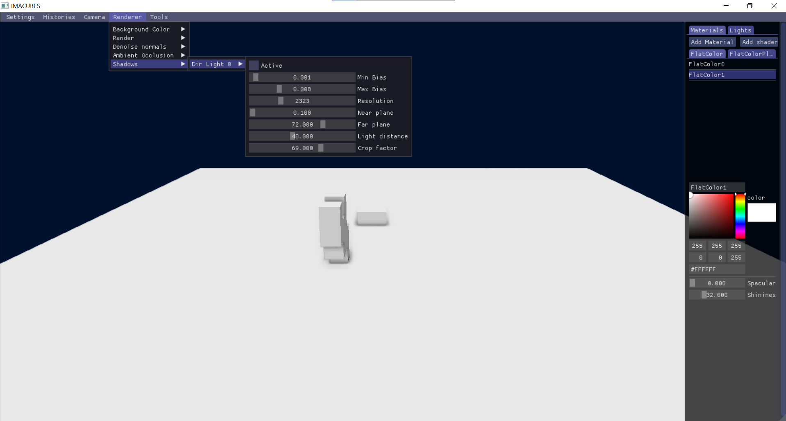

import YoutubeVideo from "/src/components/YoutubeVideo"
import Tabs from '@theme/Tabs'
import TabItem from '@theme/TabItem'

## Shadow Map

### Qu'est-ce qu'une shadow map ?

L'idée est de prendre un screenshot depuis le point de vue de la caméra, pour savoir ce qu'elle peut et ne peut pas "voir", et donc en déduire ce qui est dans la lumière ou dans l'ombre.

<Tabs>
  <TabItem value="avec" label="Avec">

  </TabItem>
  <TabItem value="sans" label="Sans">

  </TabItem>
</Tabs>

Pour tester les shadow maps et l'occlusion ambiante, vous pouvez aller sur [ce site](https://github.com/JulesFouchy/IMACUBES/releases/latest), télécharger `IMACUBES-Windows.zip`, le dézipper, et lancer `IMACUBES.exe`.

Et vous pouvez activer / désactiver les ombres et changer leurs paramètres :

### Limites

[Sur cette vidéo on voit une des limitations](https://youtu.be/T9OBDscbHwY?t=176) : seuls les objets proches ont des ombres, et elles apparaissent subitement quand on se rapproche des objets.

## Ambient Occlusion

Les shadow maps à elles seules ne suffisent pas à capturer toutes les ombres possibles de manière photoréaliste. C'est pourquoi d'autres techniques viennent les complémenter. 
L'ambient occlusion s'occupe d'obscurcir les petits recoins.

<Tabs>
  <TabItem value="avec" label="Avec">

  </TabItem>
  <TabItem value="sans" label="Sans">

  </TabItem>
</Tabs>