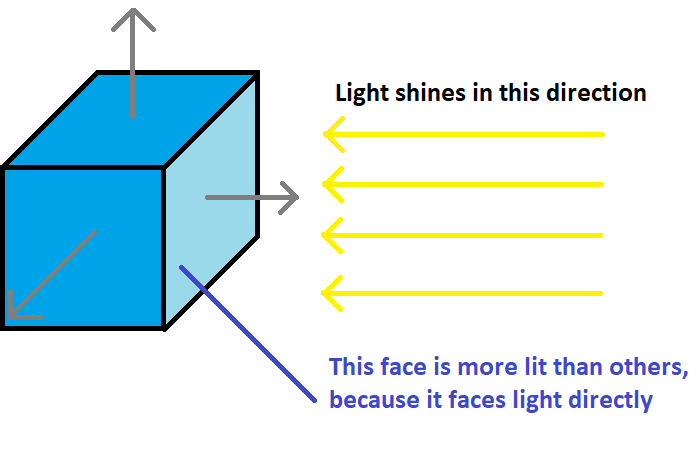
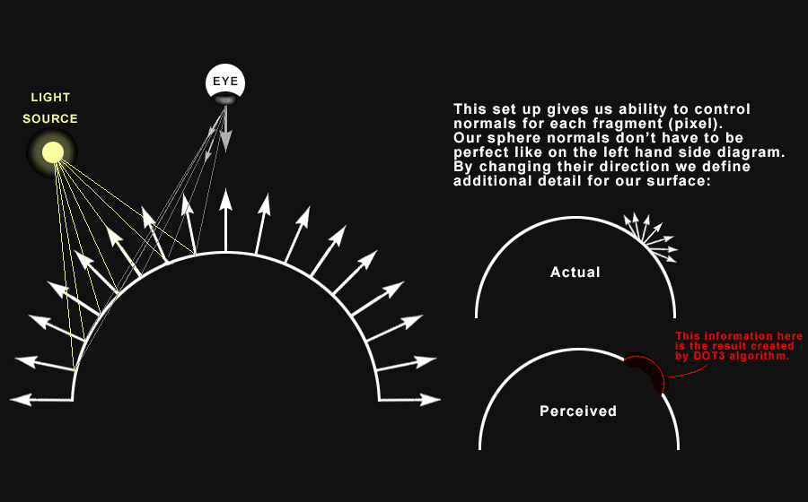
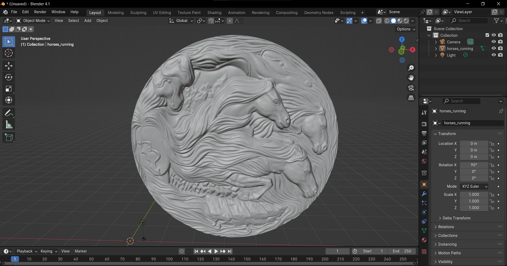
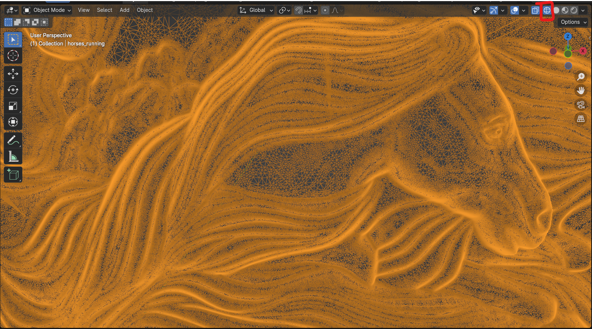
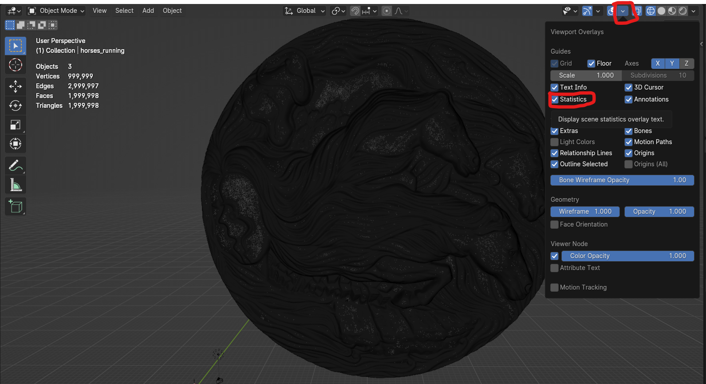

import YoutubeVideo from "/src/components/YoutubeVideo"

## Qu'est-ce qu'une normal map ?

Une normal map permet de rajouter des détails et une impression de relief sur un mesh avec relativement peu de triangles. Cela permet d'économiser beaucoup de performances, et est donc indispensable pour les assets d'un jeu vidéo !

Les normales d'un modèle sont les informations qui indiquent dans quelle direction la surface est orientée, et elles permettent de calculer les effets de lumière. Ce sont les flèches grises sur ce schéma :

Par défaut, elles sont calculées en fonction des triangles, et donc plus il y a de triangles plus les normales sont variées et rajoutent du relief. Mais il est possible de sauvegarder ces normales dans une texture, afin que chaque pixel du triangle ait une normale différente. 
On peut ainsi garder les informations des normales, même en ayant moins de triangles.

La seule chose qu'on perd avec une normal map, c'est le volume réel : en mettant votre vue rasante avec l'objet, vous verrez qu'il est plat et l'illusion est cassée.

## TP : créer une normal map

- Pour ce TP nous allons utiliser Blender. Si vous ne l'avez pas déjà, [vous pouvez le télécharger ici](https://www.blender.org/download/). NB : j'utilise la version 4.1 de Blender (la dernière en date), mais vous devriez pouvoir suivre avec n'importe quelle version de Blender.
- [Téléchargez le modèle qui nous servira d'exemple](https://www.turbosquid.com/3d-models/3d-pendant-jewelry-relief-model-1609783) et importez-le dans Blender. (Si vous avez Blender 4.1, il vous suffit de drag'n drop le fichier. Et sinon, allez dans le menu `File > Import > Wavefront (.obj)`)

- En affichant le wireframe du mesh, vous verrez qu'il contient ÉNORMÉMENT de triangles. C'est très bien pour du cinéma où on veut la qualité maximale, mais pour du jeu vidéo le coût en performance sera beaucoup trop élevé, pour un gain de qualité pas si important. On a moyen de beaucoup alléger le mesh, tout en gardant une grosse partie des détails, grâce à une normal map.

- Vous pouvez afficher le nombre de triangles en activant les statistiques

- Pour créer une normal map, suivez le tuto ci-dessous. Lors du decimate (réduction du nombre de triangles), vous pouvez mettre le ratio à 0.001 (Vous pouvez aussi expérimenter avec d'autres ratios, et voir jusqu'où vous pouvez aller tout en préservant la qualité du rendu. Vous pouvez même créer un simple cylindre, le rendu sera pas mal du tout !)
<YoutubeVideo id="l8xrSgyfEHs"/>