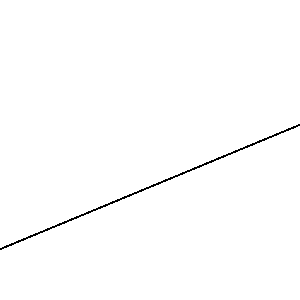
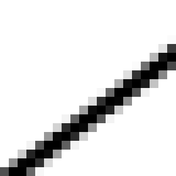
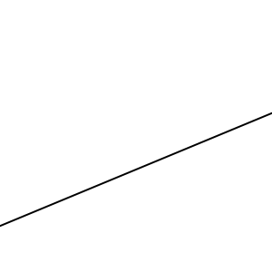

import YoutubeVideo from "/src/components/YoutubeVideo"

<YoutubeVideo id="NDo5TKr6pyc"/>
<YoutubeVideo id="T9OBDscbHwY"/>

## Qu'est-ce que l'aliasing ?

Quand vous essayez de dessiner une ligne en diagonale, elle ne peut pas aller "tout droit", elle est obligée de suivre la grille de pixels, c'est "l'effet escalier" :

Ce qui, vu de loin, donne un aspect rugueux :

L'anti-aliasing consiste à "flouter" l'objet pour que, vu de loin, il apparaisse plus lisse :

## Les différentes techniques d'anti-aliasing

### SSAA (Super-Sampling Anti-Aliasing)

➕ Excellente qualité quand on monte le nombre de samples (e.g. 64) 
➖ Très coûteux en performance 
➖ Très mauvais ratio qualité / performance

La plus vieille technique d'anti-aliasing, elle est très simple : elle revient à dessiner sur une image N fois plus grande (N = nombre de samples), puis à la downscale à la taille désirée. Ca marche très bien, mais ça prend beaucoup de temps.

### MSAA (Multi-Sampling Anti-Aliasing) et

Similaire à SSAA, en un peu moins quali et un peu meilleur en performance, mais reste très coûteux et a un mauvais ratio qualité / performance.

### FXAA (Fast Approximate Anti-Aliasing)

Une technique de post-processing, qui détecte les contours des objets et les floute. Relativement efficace et quali, mais a été remplacée par SMAA, qui fait la même chose en mieux.

### SMAA (Subpixel Morphological Anti-Aliasing)

Technique récente, très quali, comme FXAA en plus quali, mais un peu plus coûteux.

### TXAA (Temporal Anti-Aliasing)

Anti-aliasing pour les objets qui bougent.

### TAA (Temporal Anti-Aliasing)

À ne pas confondre avec TXAA! Les deux techniques n'ont rien à voir. TXAA gère les objets en mouvement, là où TAA réutilise les frames précédentes pour améliorer l'anti-aliasing.

Réutilise les informations des frames précédentes pour faire du "multisampling". Elle est donc quasiment aussi quali que SSAA, mais sans l'énorme coût en performance.
Technique très quali, très bon rapport qualité / performance, et sur laquelle de nombreux autre effets se basent. Elle a une place importante dans le pipe de rendu de tous les moteurs modernes. Rarement exposé dans les settings graphiques, car on ne peut pas le désactiver, puisque plein d'autres effets en dépendent.