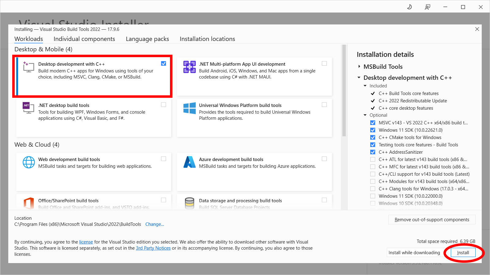
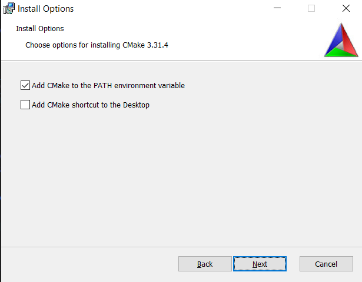
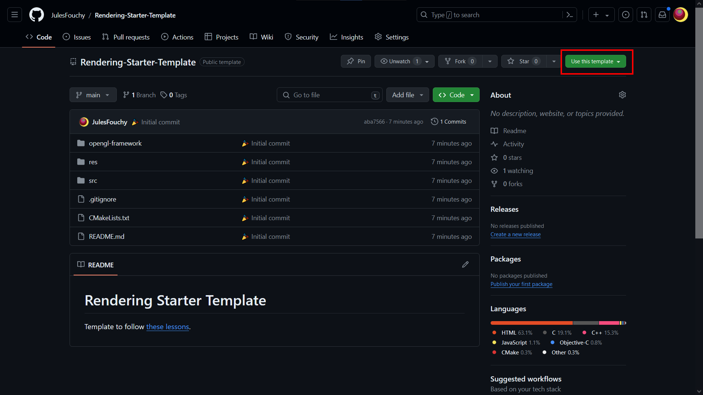
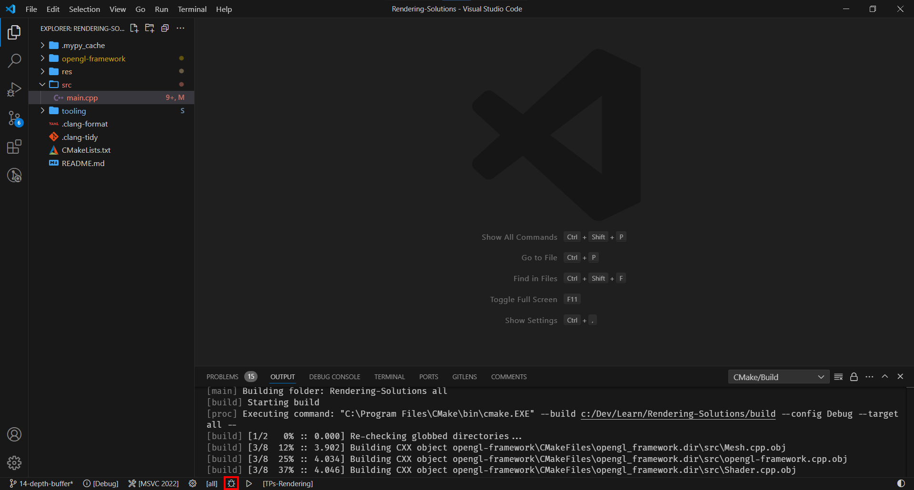

import VSCodeExtension from "/src/components/VSCodeExtension"

## Installer Git

[Téléchargez `64-bit Git for Windows Setup` depuis cette page](https://git-scm.com/download/win). Vous pouvez laisser toutes les options par défaut et installer.

Git est un outil de versioning qui vous permettra de sauvegarder votre code régulièrement, et de me le partager.

## Installer un compilateur C++

[Téléchargez `Build Tools for Visual Studio 2022` depuis cette page](https://visualstudio.microsoft.com/downloads/#remote-tools-for-visual-studio-2022), lancez l'exe, puis cochez `Desktop development with C++` et installez.

Un compilateur va transformer votre code en un programme exécutable. Vous ne l'utiliserez pas directement, mais il est nécessaire pour que tout build correctement.

## Installer CMake

[Téléchargez `Windows x64 Installer` depuis cette page.](https://cmake.org/download/) 
**IMPORTANT** : pendant l'installation, cochez bien `Add CMake to the system PATH for the current user` (ou `Add CMake to the system PATH for all users`).

CMake est l'outil de build le plus répandu pour C++. Il explique au compilateur comment compiler votre projet. Vous ne l'utiliserez pas directement, mais il est nécessaire pour que tout build correctement.

## Installer VSCode

[Téléchargez-le depuis cette page.](https://code.visualstudio.com/download)

VSCode est l'IDE ("éditeur de texte") que je vous conseille d'utiliser pour écrire votre code C++. (Vous pouvez utiliser un autre IDE si vous voulez, mais ce cours n'expliquera pas comment le setup pour faire compiler votre projet).

## Installer les extensions VSCode pour C++

- <VSCodeExtension id="ms-vscode.cpptools-extension-pack"/>: Les extensions C++ de base, obligatoires pour compiler votre projet.
- <VSCodeExtension id="raczzalan.webgl-glsl-editor"/>: L'extension GLSL, pour avoir de l'autocomplétion quand vous écrirez des shaders.
- <VSCodeExtension id="SteveBushResearch.BuildOutputColorizer"/>: Pour que les messages d'erreur apparaissent en rouge dans la console, **très pratique**.
- <VSCodeExtension id="streetsidesoftware.code-spell-checker"/>: Un correcteur d'orthographe. Marche pour l'anglais et le français. (Pour le configurer pour le français, installez en plus <VSCodeExtension id="streetsidesoftware.code-spell-checker-french"/> et suivez les instructions qui sont sur la page de téléchargement).
- <VSCodeExtension id="emmanuelbeziat.vscode-great-icons"/>: Des icônes pour plein de types de fichier (.cpp, .hpp, CMakeLists.txt, etc.).
- <VSCodeExtension id="josetr.cmake-language-support-vscode"/>: Autocomplétion pour CMake.

## Installer RenderDoc

[Téléchargez-le depuis cette page.](https://renderdoc.org/)

RenderDoc est un *débugueur pour GPU*. Il permet de voir tout ce qu'il s'est passé dans la carte graphique pendant le rendu d'une frame donnée. Il permet de voir l'état de vos meshs, les différentes étapes de la construction de l'image finale, et plein d'autres choses encore !
Nous allons beaucoup nous en servir au fil des TPs, à la fois pour débuguer notre code, et aussi juste pour inspecter et mieux comprendre ce qu'il se passe dans la carte graphique.

## Télécharger la base de code

Vous êtes maintenant prêt.e à coder ! Nous allons partir de [ce template de code](https://github.com/JulesFouchy/Rendering-Starter-Template) qui inclue toutes les libraires nécessaires. Vous pouvez directement créer un repository GitHub à partir de celui-ci en faisant `Use this template` :

(Et sinon vous pouvez aussi juste télécharger le code normalement, et créer un repo de votre côté).

## Compiler

Pour lancer votre projet, il vous suffit maintenant d'appuyer sur le petit insecte depuis VSCode. 
La première fois, il va vous demander quel compilateur vous voulez utiliser : il faudra probablement faire `[Scan for kits]`, puis sélectionnez le compilateur qui mentionne `amd64`.

