import YoutubeVideo from "/src/components/YoutubeVideo"

## La structure de l'application

Pour l'instant dans `src/main.cpp` vous avez ceci :

```cpp
#include "opengl-framework/opengl-framework.hpp" // Inclue la librairie qui va nous servir à faire du rendu

int main()
{
    // Initialisation
    gl::init("TPs de Rendering"); // On crée une fenêtre et on choisit son nom
    gl::maximize_window(); // On peut la maximiser si on veut

    while (gl::window_is_open())
    {
        // Rendu à chaque frame
    }
}
```

La boucle `while` est ce qu'on appelle la *boucle de rendu* ; chaque itération correspond à *une frame*, et il faudra y mettre le code dessinant ce qu'on veut pour cette frame.

En exécutant ce code, vous devriez avoir une fenêtre noire qui s'ouvre :
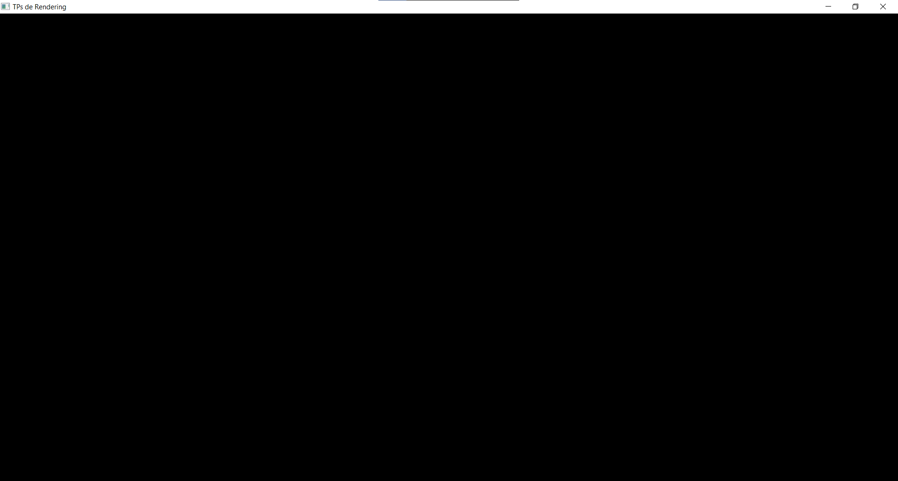

## Couleur de fond

Pour commencer très simplement on peut choisir la couleur de fond, au début de la boucle de rendu :

```cpp
glClearColor(0.f, 0.f, 1.f, 1.f); // Choisis la couleur à utiliser. Les paramètres sont R, G, B, A avec des valeurs qui vont de 0 à 1
glClear(GL_COLOR_BUFFER_BIT); // Exécute concrètement l'action d'appliquer sur tout l'écran la couleur choisie au-dessus
```
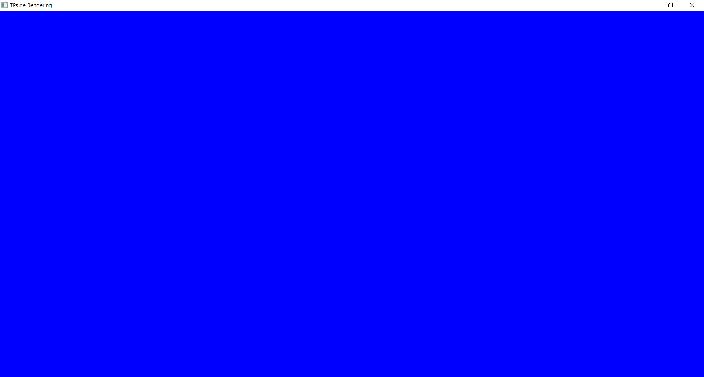

:::tip Note
En plus de choisir la couleur, l'opération `glClear(GL_COLOR_BUFFER_BIT)` est très importante car elle reset l'image entre deux frames. Sans elle, les objets dessinés ne disparaissent pas d'une frame à l'autre (ce qui peut permettre des effets artistiques intéressants, mais est embêtant pour un rendu "classique"). Vous pourrez essayer ça [un peu plus tard](#exercice--faire-bouger-le-carr%C3%A9) quand nous saurons dessiner des objets qui bougent.
:::

## OpenGL

Nous utilisons l'API **OpenGL** pour communiquer avec la carte graphique. Il en existe d'autres, mais elles sont soit plus difficiles à apprendre (Vulkan, WebGPU), soit spécifiques à un OS (DirectX pour Windows, Metal pour Mac).

Si jamais vous cherchez de l'aide sur Internet ou ChatGPT, pensez à bien préciser OpenGL dans votre recherche. Et sinon, vous trouverez la documentation de toutes les fonctions OpenGL sur [docs.gl](https://docs.gl/).

:::info Remarque
Tout ce qui commence par `gl::` (comme `gl::init()`) ne fait pas partie de l'API OpenGL de base, mais d'un wrapper que je vous fournis pour vous simplifier la vie. Par contre ce qui commence par `gl` (comme `glClearColor`) fait partie de l'API OpenGL officielle.
:::

## Mesh

### Vertex Buffer et Premier Triangle

Nous allons maintenant dessiner notre premier objet ! Pour décrire notre objet à la carte graphique, nous utilisons un **mesh**, c'est-à-dire une longue liste de triangles qui, mis bout-à-bout, dessinent notre forme en 3D :


Pendant l'initialisation nous pouvons créer un objet de type `gl::Mesh` :
```cpp
auto const triangle_mesh = gl::Mesh{{
    .vertex_buffers = {{
        .layout = {gl::VertexAttribute::Position2D{0 /*Index de l'attribut dans le shader, on en reparle juste après*/}},
        .data   = {
            -1.f, -1.f, // Position2D du 1er sommet
            +1.f, -1.f, // Position2D du 2ème sommet
             0.f, +1.f  // Position2D du 3ème sommet
        },
    }},
}};
```
que nous allons ensuite dessiner à chaque frame dans la boucle de rendu :
```cpp
gl::bind_default_shader(); // On a besoin qu'un shader soit bind (i.e. "actif") avant de draw(). On en reparle dans la section d'après.
triangle_mesh.draw(); // C'est ce qu'on appelle un "draw call" : on envoie l'instruction à la carte graphique de dessiner notre mesh.
```

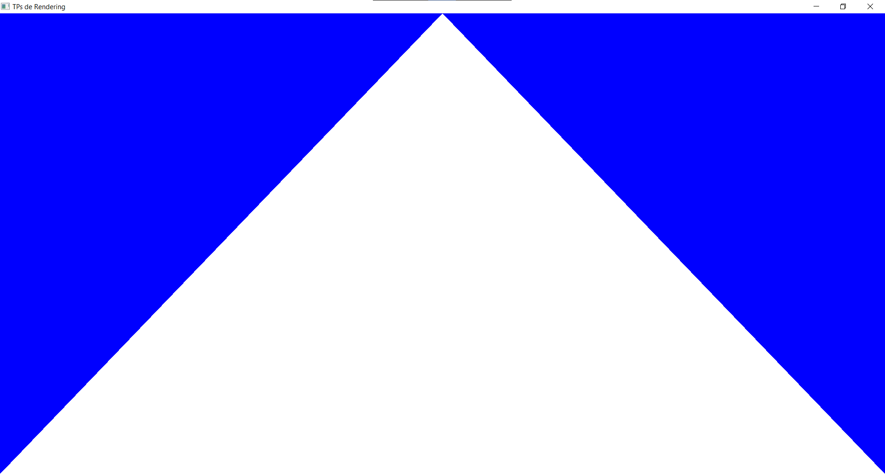

Il y a déjà plein de chose à dire ! Quand on crée un mesh, on lui passe un **vertex buffer** :
```cpp
.vertex_buffers = {{
    .layout = {gl::VertexAttribute::Position2D{0 /*Index de l'attribut dans le shader, on en reparle juste après*/}},
    .data   = {
        -1.f, -1.f, // Position2D du 1er sommet
        +1.f, -1.f, // Position2D du 2ème sommet
         0.f, +1.f  // Position2D du 3ème sommet
    },
}},
```
Un *vertex buffer* c'est le tableau qui contient toutes les données décrivant notre mesh : position des sommets des triangles, mais également plein d'autres données optionnelles : couleur, normale, coordonnée de texture (UV), etc.<br/>
En fait c'est nous qui décidons quoi mettre dans ce buffer, puis que faire de ces données quand on code le vertex shader (que nous verrons plus tard). Pour faire du rendu classique on utilise généralement position + normales + UV. Mais on peut aussi imaginer d'autres usages plus créatifs et rajouter toutes les données dont on pourrait avoir besoin pour un effet précis.

:::info Remarque
Un usage original : on peut stocker la distance au tronc sur chaque vertex des branches et feuilles des arbres. Cette distance est ensuite utilisée pour calculer à quel point la branche peut ployer sous l'effet du vent. (La partie attachée au tronc ne doit pas bouger, et plus on s'en éloigne plus on peut bouger librement).<br/>
Stocker cette distance dans le vertex buffer évite de la recalculer à chaque frame : c'est beaucoup plus optimisé.

[C'est utilisé dans God of War par exemple :](https://youtu.be/MKX45_riWQA?t=1085)
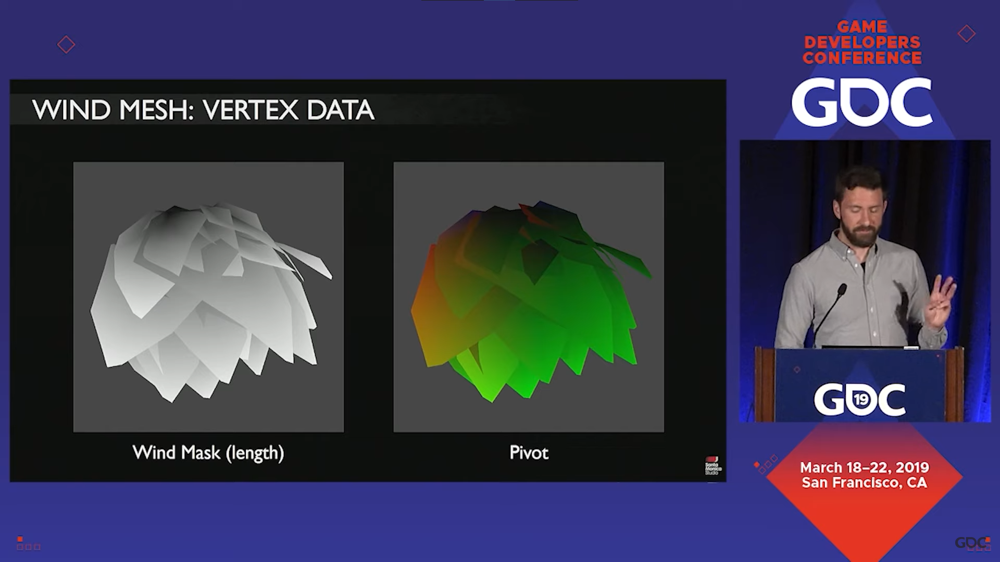
:::

Décrire ce vertex buffer se passe en deux étapes : son **layout** et ses **data**.<br/>
Le `layout` indique comment `data` est structuré : dans notre exemple on a juste des positions 2D qui s'enchaînent, mais ça pourrait aussi être des positions 3D, et on pourrait aussi avoir d'autres attributs dans le même tableau `data`, par exemple des coordonnées de texture, comme on verra [plus tard](#uv). Pour chaque *attribut* du layout, il faut préciser son *index* (`0` dans notre cas), une information qui nous servira plus tard pour récupérer l'attribut du côté du *shader*.

Vous remarquerez aussi que `vertex_buffers` est un tableau de vertex buffers ! Il est en effet possible d'avoir plusieurs vertex buffers, par exemple un qui stocke les positions, et un autre qui stocke les normales. Ça revient au même que de mettre tous les attributs dans le même vertex buffer, mais ça peut avoir des performances soit meilleures soit pires, en fonction des situations. C'est une question un peu compliquée dont nous ne soucierons pas, et nous utiliserons simplement ce qui est le plus pratique pour nous.

Enfin, dans `data` nous mettons nos positions 2D :
```cpp
.data = {
    -1.f, -1.f, // Position2D du 1er sommet
    +1.f, -1.f, // Position2D du 2ème sommet
     0.f, +1.f  // Position2D du 3ème sommet
},
```
Le système de coordonnées marche ainsi : **x et y vont toujours de -1 à 1**. Ainsi, `x = -1` représente toujours le côté gauche de la fenêtre, et `y = 1` représente toujours le haut de la fenêtre. Vous remarquerez donc que quand vous redimensionnez la fenêtre, le triangle se "déforme" pour continuer à remplir toute la fenêtre. Ce n'est généralement pas ce qu'on veut, et nous verrons comment remédier à ça [plus tard](#envoyer-des-param%C3%A8tres-au-shader--les-uniforms).

### RenderDoc

Avant d'aller plus loin, nous allons commencer à découvrir RenderDoc, un super outil qui nous permettra de débuguer si jamais notre rendu ne se fait pas comme on voudrait.

:::info Remarque
Si jamais vous avez besoin de RenderDoc dans Unreal ou Unity, c'est possible ! Vous pouvez ouvrir ces moteurs directement dans RenderDoc, mais même encore mieux il y a [un plugin RenderDoc pour Unreal](https://docs.unrealengine.com/4.27/en-US/TestingAndOptimization/PerformanceAndProfiling/RenderDoc/), et le [Frame Debugger pour Unity](https://youtu.be/4N8GxCeolzM) qui est un équivalent de RenderDoc intégré directement dans Unity.
:::

La première chose à faire quand vous ouvrez RenderDoc, c'est d'aller dans l'onglet `Launch Application` pour choisir l'exécutable à débuguer (qui va se trouver dans le dossier de votre projet, et le sous-dossier build. Il devrait s'appeler `TPs-Rendering.exe`):

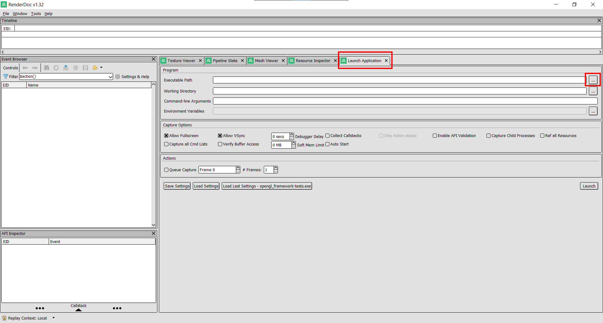

Une fois que s'est fait, vous pouvez cliquer sur `Launch` :

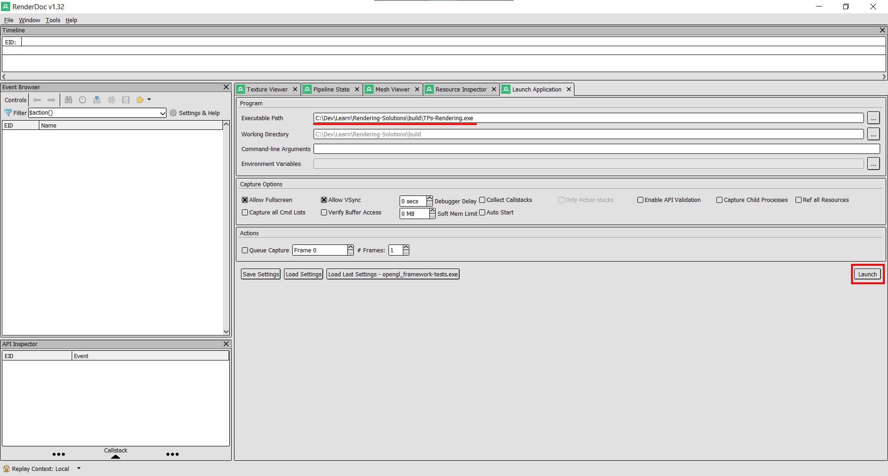

qui va lancer votre application en "mode RenderDoc" :

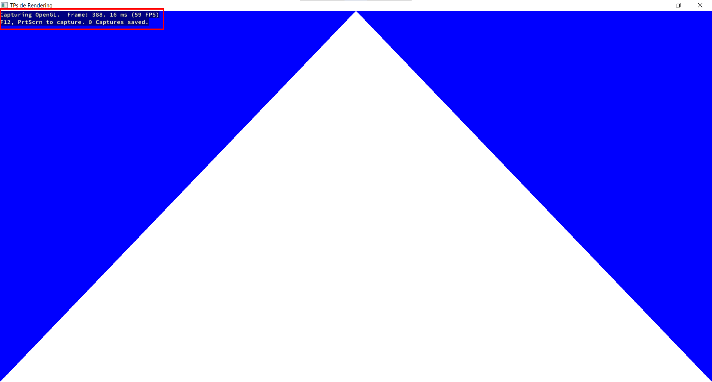

Vous pouvez alors faire <kbd>F12</kbd> pour capturer une frame, puis fermer l'application, et RenderDoc va vous permettre d'inspecter la frame que vous venez de capturer :

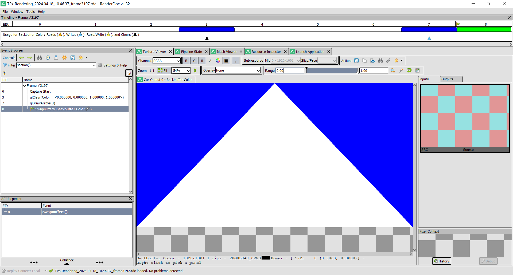

La première chose à regarder, c'est la timeline sur le côté, qui indique toutes les opérations OpenGL qui ont été exécutées pendant la frame. Vous pouvez cliquer sur chacune d'elle, et voir le rendu à ce moment là de la frame :

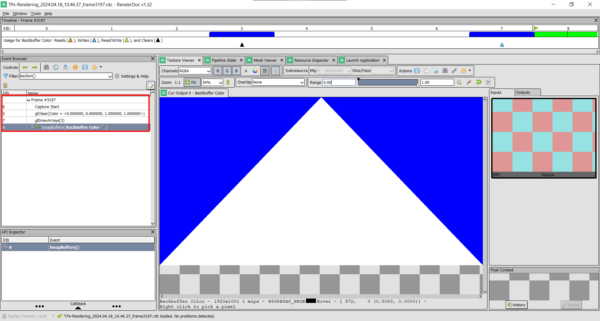

Dans notre cas c'est très simple, il y a la couleur de fond qui est faite avec `glClear`, puis le draw call de notre mesh avec `glDrawArrays` (le 3 indique qu'il y avait 3 sommets dans notre vertex buffer).

Ensuite on peut inspecter chaque étape du rendu en cliquant dessus. Ce qui va nous intéresser c'est le draw call de notre mesh, donc cliquez sur l'étape `glDrawArrays`.

La première chose à faire, si typiquement votre mesh ne s'affiche pas, c'est d'aller dans `Overlay`, et de sélectionner `Highlight Drawcall`. Ça va indiquer là où votre mesh a atterri à l'écran.

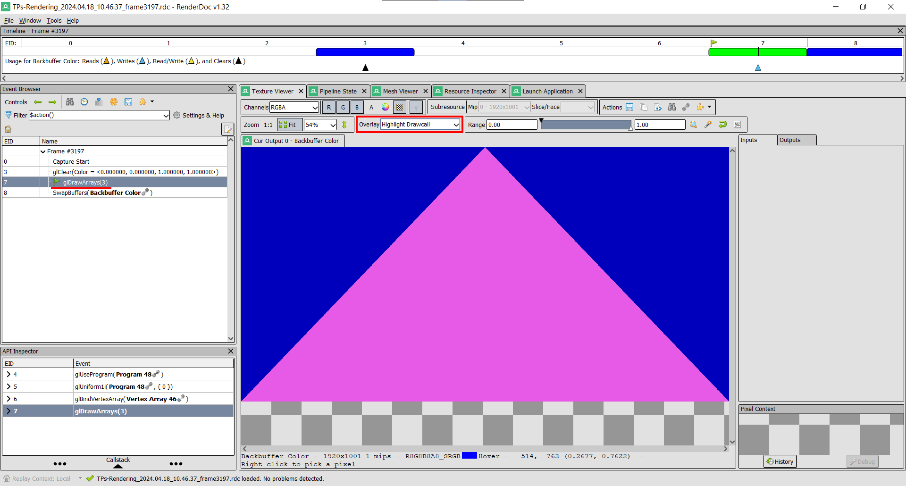

Si vous voyez bien votre mesh en magenta dans le draw call, mais qu'ensuite le triangle ne s'affiche pas, c'est déjà une très bonne information ! Dans ce cas vous pouvez ensuite passer le mode d'overlay en `Depth Test`, puis `Stencil Test`, puis `Backface Cull`. Si l'un d'eux affiche votre mesh en rouge, c'est que cette étape du rasterizer a décidé de skipper votre mesh. Nous reparlerons de ces étapes plus tard ([Depth Test](#depth-buffer), [Stencil Test](TODO), [Backface Culling](TODO)). Sinon, si tout est vert mais que votre mesh ne s'affiche quand même pas, c'est probablement au niveau du fragment shader qu'il y a un problème.

Si à l'inverse dès l'overlay `Highlight Drawcall` vous ne voyez pas votre mesh, alors c'est le mesh lui-même qui a un problème. Vous pouvez alors aller dans l'onglet `Mesh Viewer` :

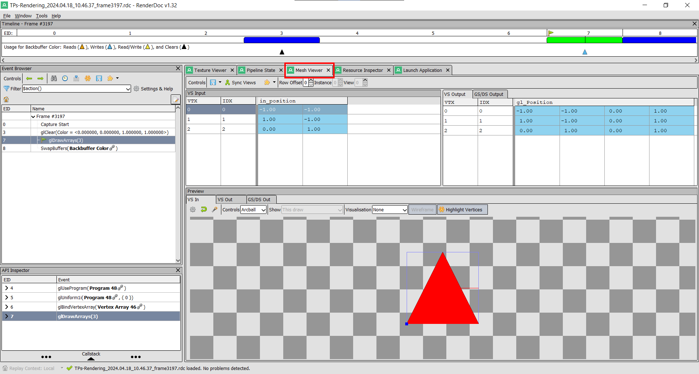

Ici vous avez plein d'informations : d'abord la vue `VS In` vous montre votre mesh tel qu'il était avant le vertex shader :

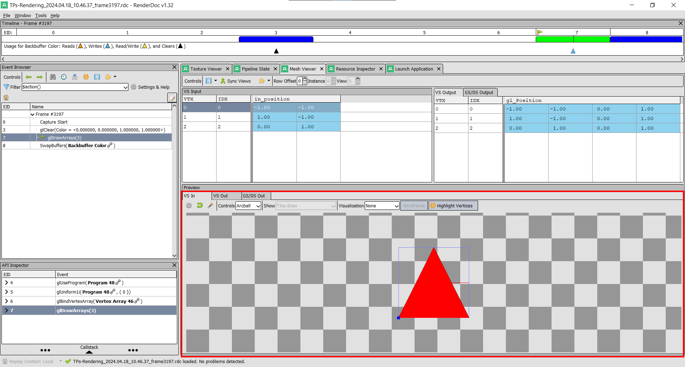

Si votre mesh apparaît bien ici, tant mieux ! Et sinon, c'est probablement que votre vertex buffer n'est pas bon ! Vous pouvez inspecter votre vertex buffer dans la vue `VS Input`, et regarder si il y a des valeurs bizarres / pas assez de vertexs / un layout qui ne correspond pas à ce que vous pensiez avoir spécifié, etc. Dans cet example, on voit que tout va bien, et on retrouve les valeurs qu'on avait mises dans notre vertex buffer : 

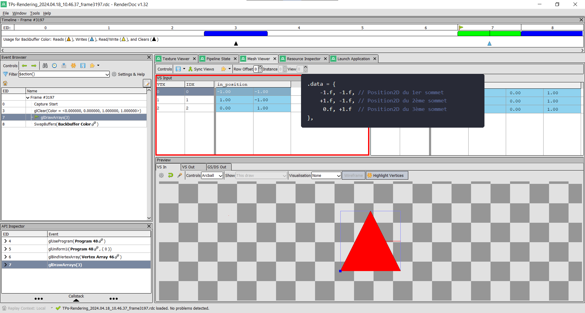

Ensuite, vous pouvez aller voir dans `VS Out` l'état de votre mesh après le vertex shader. Dans les sections suivantes nous appliquerons des transformations au mesh dans le vertex shader (déplacement, caméra, etc.), et vous pourrez voir le résultat ici :

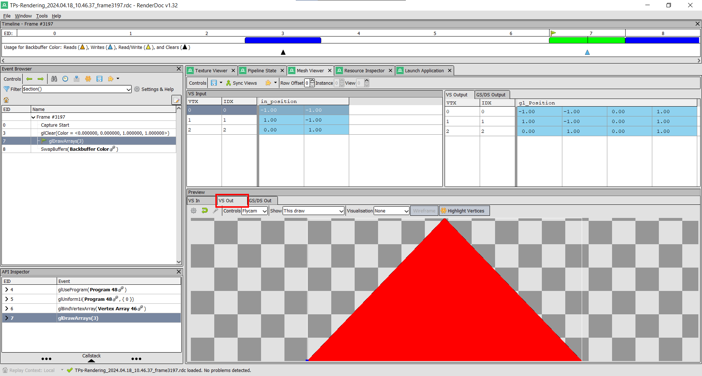

Et une fois de plus, si vous avez besoin d'inspecter les valeurs précises, elles sont toutes dans la vue `VS Output` :


RenderDoc permet encore beaucoup d'autres choses, mais vous avez vu l'essentiel qui vous sauvera 99% du temps !

### Dessiner un rectangle

Maintenant, à vous de jouer ! Modifiez le code qui crée votre mesh afin d'avoir non plus un triangle, mais un rectangle qui prendra la moitié de l'écran. Il vous faudra dessiner deux triangles, et donc indiquer six sommets dans le vertex buffer.

Si vous avez un problème de rendu, pensez à aller voir dans RenderDoc ce qu'il se passe !

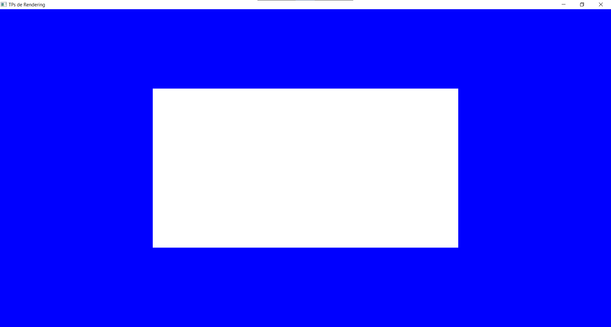

### Index buffer

Vous avez peut-être remarqué une chose en faisant le vertex buffer du rectangle, c'est que vous avez dû écrire certains sommets deux fois ! (Une fois pour dessiner le premier triangle, puis une deuxième fois pour le deuxième triangle). Et d'ailleurs, six sommets pour un rectangle ça fait beaucoup, 4 devraient suffire !<br/>
C'est un problème qui devient d'autant plus embêtant que sur un vrai mesh les sommets sont parfois partagés par bien plus que deux triangles, et donc doivent être dupliqués plein de fois, ce qui augmente considérablement la taille du mesh.

Heureusement, ce problème a une solution : l'**index buffer** !

Quand on crée notre `gl::Mesh` on peut, en plus du vertex buffer, spécifier un index buffer :

```cpp
auto const rectangle_mesh = gl::Mesh{{
    .vertex_buffers = {{
        .layout = {gl::VertexAttribute::Position2D{0}},
        .data   = {
            -0.5f, -0.5f, // Position2D du 1er sommet
            +0.5f, -0.5f, // Position2D du 2ème sommet
            +0.5f, +0.5f, // Position2D du 3ème sommet
            -0.5f, +0.5f  // Position2D du 4ème sommet
        },
    }},
    .index_buffer   = {
        0, 1, 2, // Indices du premier triangle : on utilise le 1er, 2ème et 3ème sommet
        0, 2, 3  // Indices du deuxième triangle : on utilise le 1er, 3ème et 4ème sommet
    },
}};
```

Les indices dans l'index buffer vont par 3, et décrivent un triangle en indiquant quels sommets prendre dans le vertex buffer.


Le rendu est exactement le même, mais notre vertex buffer est plus simple à écrire, et plus léger pour l'ordinateur !

Vous allez pouvoir tester d'écrire vous-même un index buffer [quand vous ferez un cube](#cube), mais avant cela il nous manque quelques étapes pour passer en 3D !

## Shader

Un **Shader** est un programme exécuté par la carte graphique. Il existe deux principaux types de shaders :
- Le **Vertex Shader** qui prend un sommet dans notre vertex buffer et le modifie (déplacement, application de la perspective 3D, etc.)
- Le **Fragment Shader** qui prend un pixel de notre triangle et le colorie (en fonction de son matériau, de la lumière, etc.)

:::info Remarque
Il existe aussi les **Compute Shaders** qui sont plus génériques et prennent n'importe quel type de buffer et le modifient. Ils sont très utilisés pour faire des simulations sur GPU (particules, fluides, vêtements, etc.).
:::

Pour créer un shader, il vous suffit de faire, dans l'initialisation :
```cpp
auto const shader = gl::Shader{{
    .vertex   = gl::ShaderSource::File{"res/vertex.glsl"},
    .fragment = gl::ShaderSource::File{"res/fragment.glsl"},
}};
```

et de créer les deux fichiers correspondants, dans le dossier *res* :
```glsl title="res/vertex.glsl"
#version 410

layout(location = 0) in vec2 in_position;

void main()
{
    gl_Position = vec4(in_position, 0., 1.);
}
```

```glsl title="res/fragment.glsl"
#version 410

out vec4 out_color;

void main()
{
    out_color = vec4(1.);
}
```

:::info IMPORTANT
Tous les assets (shader, texture, modèle 3D, etc.) doivent être mis dans le dossier `res`, **et pas un autre**, car ce dossier est copié pour être mis à côté de l'exe dans le dossier build. (C'est fait dans le CMakeLists.txt, par la ligne `gl_target_copy_folder(${PROJECT_NAME} res)`). Si jamais vous vouliez renommer le dossier *res* ou en ajouter un autre, il faudrait bien penser à aller modifier le CMakeLists.txt !
:::

Puis pour utiliser ce shader à la place du shader par défaut, remplacez la ligne `gl::bind_default_shader();` par `shader.bind();` :


Le rendu n'a toujours pas changé, car les shaders que je vous ai donnés sont équivalents aux shaders par défaut qu'on utilisait jusque là. Mais ça ne saurait tarder, nous allons maintenant pouvoir modifier nos shaders comme on veut ! Mais avant tout, quelques explications :

### GLSL

Déjà, le GLSL est le langage utilisé pour écrire des shaders. Il ressemble très fort à du C, avec en plus quelques fonctions et types très souvent utilisés en rendu 3D : vecteurs (`vec2`, `vec3`, `vec4`), matrices (`mat2`, `mat3`, `mat4`), et fonctions géométriques (produit scalaire `dot(v1, v2)`, normalisation d'un vecteur `normalize(v)`, etc.).

Chaque shader doit commencer par une indication de la version utilisée (`#version 410`). Nous utilisons la 410, qui est la dernière supportée par MacOS. (Et sinon elles vont jusqu'à 460, mais il n'y a aucune différence en ce qui nous concerne).

### Vertex Shader

Le vertex shader commence par une déclaration des attributs :

```glsl
layout(location = 0) in vec2 in_position;
```

Ces attributs doivent correspondre au layout de notre vertex buffer :

```cpp
.vertex_buffers = {{
    .layout = {gl::VertexAttribute::Position2D{0 /*Index de l'attribut dans le shader*/}},
    .data   = {
        // ...
    },
}},
```

Le `layout(location = 0)` correspond à l'index `0` spécifié pour `gl::VertexAttribute::Position2D`, et le type `vec2` vient du fait que nos positions 2D sont des vecteurs à deux composantes (si on utilisait des positions 3D, il faudrait mettre `vec3`). Le nom `in_position` est libre et vous pouvez mettre ce que vous voulez.

Ensuite, dans la fonction `main()` on assigne la variable `gl_Position`, qui est une variable spéciale indiquant à OpenGL la position finale du vertex (ce qui correspond au `VS Out` qu'on avait vu dans RenderDoc).

En guise de premier exercice, vous pouvez déplacer le rectangle via le vertex shader, par exemple de `0.4` en x et en y :

:::tip
Vous ne pouvez pas modifier la variable `in_position` car elle vient du vertex buffer, et modifier le vertex buffer n'est pas autorisé dans le vertex shader. À la place, créez une copie :
```glsl
#version 410

layout(location = 0) in vec2 in_position;

void main()
{
    // highlight-next-line
    vec2 position = in_position;
    // ...
    // Modifiez `position` comme vous voulez
    // ...
    // highlight-next-line
    gl_Position = vec4(position, 0., 1.); // Ici on utilise maintenant `position` et non plus `in_position`
}
```
:::

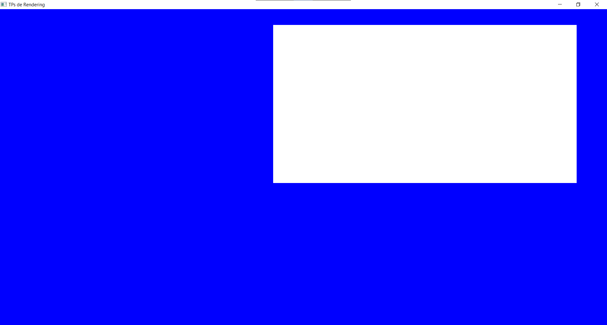

### Fragment Shader

Le fragment shader commence par 

```glsl
out vec4 out_color;
```

qui déclare la variable de sortie : ce qu'on assigne à cette variable correspondra à la couleur du pixel à l'écran.

Et dans le `main()` on fait quelque chose de très simple, qui est d'assigner la même couleur à tous les pixels, sans réfléchir :

```glsl
out_color = vec4(1.);
```

:::tip Note
- La syntaxe `vec4(1.)` est un raccourci pour `vec4(1., 1., 1., 1.)`. On peut même faire des choses comme `vec4(vec3(0.5), 1.)`, qui revient à faire `vec4(0.5, 0.5, 0.5, 1.)`.
- Les composantes R, G, B et A des couleurs vont de 0 à 1, donc `vec3(1., 1., 1.)` correspond à mettre le maximum de rouge, vert et bleu, donc du blanc pur.
:::

En guise de premier exercice, vous pouvez changer la couleur du rectangle :

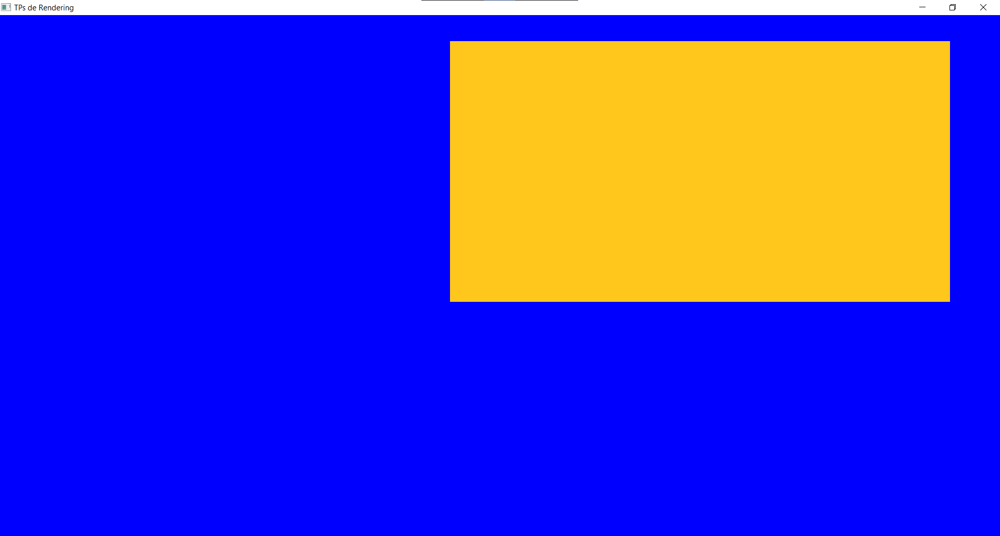

### Envoyer des paramètres au shader : les uniforms

Pour que nos shaders deviennent intéressants, il faut leur envoyer plus de données en entrée. On peut soit rajouter des attributs dans le vertex buffer (couleur, UV, normale, etc.), [ce que nous verrons plus tard](#uv) ; soit envoyer des paramètres appelés `uniforms`. Une variable uniforme se déclare ainsi dans le shader, au-dessus du `main()` :

```glsl
uniform vec2 nom_de_votre_variable_uniforme; // Vous pouvez mettre le type que vous voulez, et le nom que vous voulez
```

puis peut s'utiliser dans votre shader comme vous le voulez, comme n'importe quelle variable normale.

Pour assigner la valeur d'une variable uniforme, cela se fait dans votre code C++, après avoir bind le shader :

```cpp
shader.set_uniform("nom_de_votre_variable_uniforme", glm::vec2{1.f, 3.f});
```

:::tip Remarque
On utilise la librairie `glm` pour avoir des types vecteur et matrice comme en glsl : `glm::vec2`, `glm::vec3`, `glm::vec4`, `glm::mat2`, `glm::mat3`, `glm::mat4`, etc.
:::

:::info Note
Une variable `uniform` s'appelle ainsi car elle est uniforme pour un draw call : ça sera la même pour tous les vertexs et pour tous les pixels lors d'un appel donné à `mesh.draw()`.<br/>
Si on voulait une valeur qui est différente pour chaque vertex, il faudrait passer par un attribut de vertex.
:::

On peut par exemple utiliser les uniforms pour régler [notre problème de taille de rectangle qui suit la fenêtre](#vertex-buffer-et-premier-triangle). Pour cela, nous allons passer au shader **l'aspect ratio** de la fenêtre (i.e. `largeur / hauteur`), et corriger la position en x de nos vertexs en fonction du ratio.

- Déclarez une uniform `aspect_ratio` de type `float` dans le vertex shader
- Divisez le x de la position de votre vertex par `aspect_ratio`
- Côté C++, passez la uniform au shader (Vous pouvez obtenir l'aspect ratio de la fenêtre avec `gl::framebuffer_aspect_ratio()`)

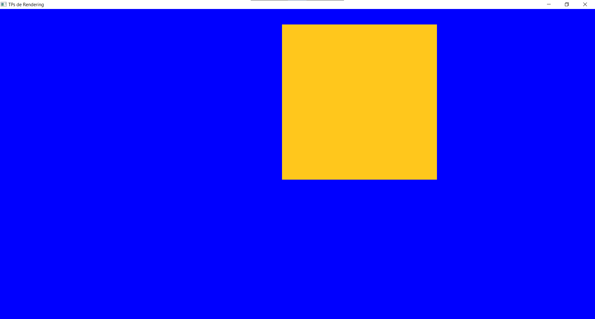
*Enfin un carré qui reste carré peu importe la taille de la fenêtre !*

:::tip Remarque
On pourrait se dire qu'il suffisait de créer un nouveau vertex buffer avec des positions qui prennent en compte l'aspect ratio, et de recréer le buffer à chaque fois que l'aspect ratio change. Mais ça impliquerait de modifier potentiellement les millions de vertexs de notre mesh, ce qui prendrait beaucoup de temps. Alors que le vertex shader lui va faire ça en un rien de temps : c'est la puissance de la carte graphique, qui peut traiter tous les sommets en parallèle extrêmement vite !
:::

### Exercice : Faire bouger le carré

Vous pouvez utiliser `gl::time_in_seconds()` pour récupérer le temps, l'envoyer au shader, et vous en servir pour faire bouger le carré. Le plus simple est de le faire aller en ligne droite, mais vous pouvez aussi (bonus) le faire aller et revenir, ou tourner en rond :

| 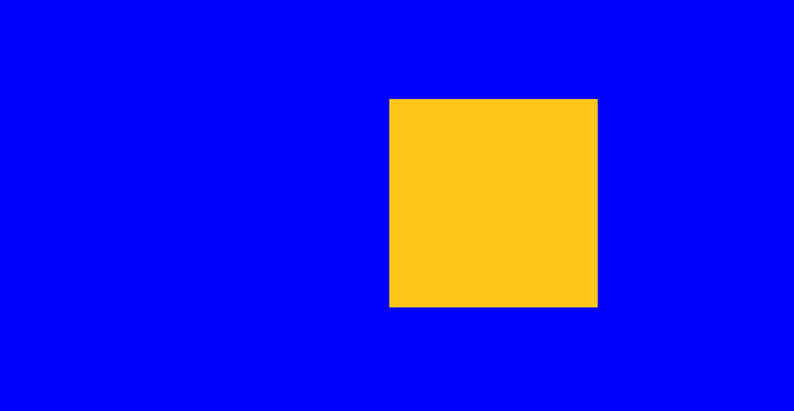      | 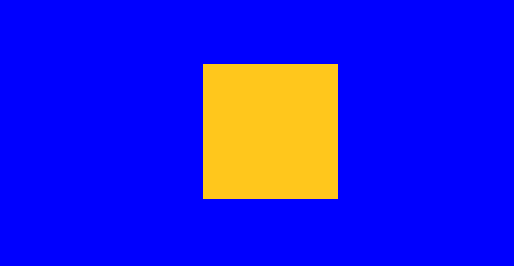 |   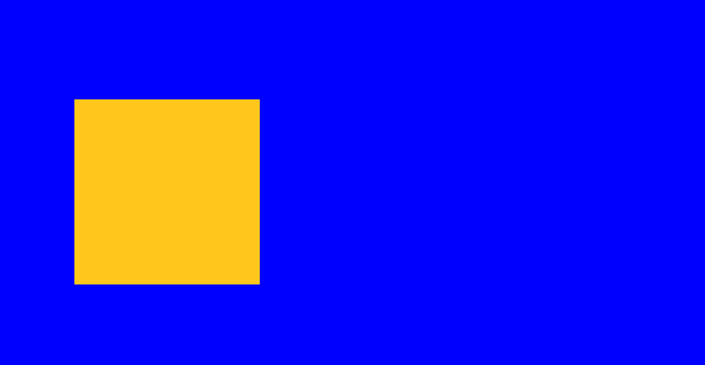 |
| ----------- | ----------- | ----------- |

:::tip Remarque
Maintenant qu'on a un objet qui bouge, on peut enfin tester ce qu'il se passe quand on enlève la ligne `glClear(GL_COLOR_BUFFER_BIT);`. Je vous laisse essayer !
:::

### Bonus : effet de fade

Vous avez toutes les cartes en main pour faire cet effet de fade, alors je vous laisse chercher comment faire 😉

:::tip Info
Vous aurez probablement besoin d'utiliser de la transparence à un moment, qui nécessite d'être activée, au début de l'initialisation, avec :
```cpp
glEnable(GL_BLEND);
glBlendFuncSeparate(GL_SRC_ALPHA, GL_ONE_MINUS_SRC_ALPHA, GL_ONE_MINUS_DST_ALPHA, GL_ONE); // On peut configurer l'équation qui mélange deux couleurs, comme pour faire différents blend mode dans Photoshop. Cette équation-ci donne le blending "normal" entre pixels transparents.
```
:::


:::info Remarque
Si vous voyez un effet de clignotement, c'est normal, c'est dû à la swapchain : en fait il y a deux images qui s'alternent : l'une qui est affichée à l'écran, et l'autre sur laquelle on est en train de dessiner. (Si on dessinait sur l'image qui est actuellement affichée à l'écran, on verrait les pixels se dessiner petit à petit et ça ferait très moche). Pour résoudre ce clignotement, il faudrait faire le rendu de toute notre scène dans une [render target](#render-target) à part, qu'on copierait à l'écran à la fin de chaque frame. Nous verrons cette notion plus tard.
:::

:::info Remarque
Il reste une trace qui ne s'efface pas, c'est dû à des problèmes d'arrondi au moment du calcul de la transparence, car chaque canal de couleur est stocké sur un entier à 8 bits seulement (par défaut). En faisant notre rendu sur une [render target](#render-target) utilisant 16 ou 32 bits par canal, ça résoudrait le problème.
:::

:::info Remarque
Cet effet dépend du framerate ! Si vous dessinez deux fois plus d'images par seconde, la trace va s'effacer deux fois plus vite. Pour éviter cela, il faudrait prendre en compte `gl::delta_time_in_seconds()`, qui donne le temps écoulé entre deux frames.
:::

## Caméra et Matrices

Il est temps de passer en 3D !

Pour cela nous avons besoin de deux informations : 

- Le point de vue, i.e. savoir où on est dans l'espace, et dans quelle direction on regarde
- La projection, pour donner l'effet de perspective inhérent à la 3D

Pour représenter ces deux informations, nous allons utiliser des **matrices**. Une matrice est un objet mathématique qui permet de représenter une transformation géométrique. On applique une matrice à un **vecteur** (point ou direction, en 2D ou en 3D) pour lui appliquer la transformation géométrique représentée par la matrice. Par exemple on peut créer une matrice de rotation qui, quand elle est appliquée à un point, fait tourner ce point.

:::info Remarque
Une matrice est un grille de nombre. Par exemple une matrice 3D (`mat3`) ressemblerait à :
$$
\begin{pmatrix}
1 & 0 & 4 \\
0 & 1 & 2 \\
0 & 0 & 1
\end{pmatrix}
$$
Je ne rentrerai pas dans les détails de quels nombres mettre dans la matrice pour représenter quelle transformation, car nous allons utiliser la librairie `glm` pour créer toutes ces matrices.
:::

Le gros intérêt des matrices est qu'on peut les combiner entre elles en les multipliant ! Par exemple si j'ai une matrice 3D de rotation `R` et une matrice 3D de translation `T`, alors `R * T` est une nouvelle matrice 3D, dont la transformation géométrique est une translation suivie d'une rotation (**NB :** la transformation de droite est appliquée en première).

On peut ainsi construire une seule matrice finale, représentant la combinaison du point de vue (**view matrix**) et de la projection (**projection matrix**). On peut aussi y rajouter une modification de notre mesh (pour faire tourner le mesh, le translater pour le positionner dans le monde où on veut, etc.) (**model matrix**). Ensuite on envoie cette seule matrice au shader, il l'applique à la position de nos vertexs, et le tour est joué !

:::tip Attention
L'ordre des matrices a son importance ! `R * T` est différent de `T * R`.<br/>
`T * R` est une rotation suivie d'une translation, ce qui est différent de d'abord faire la translation puis la rotation, comme vous pourrez le constater [dans l'exercice qui suit](#exercice--model-matrix).
:::

:::info Remarque
On ne peut pas représenter n'importe quelle transformation géométrique avec des matrices, seulement celles qui sont affines. Mais c'est déjà bien assez, car les translations, les rotations et les aggrandisements sont toutes des transformations affines.<br/>
Vous pouvez [tester cette démo interactive](https://www.geogebra.org/m/tn9jqqdt) pour voir quel genre de transformation géométrique une matrice peut produire, et aussi regarder [cette excellentissime vidéo](https://youtu.be/kYB8IZa5AuE?list=PLZHQObOWTQDPD3MizzM2xVFitgF8hE_ab).
:::

### View Matrix

Pour obtenir la **View Matrix** nous allons utiliser une **caméra**, que nous pourrons contrôler pour se déplacer dans le monde :

```cpp
// Dans l'initialisation
auto camera = gl::Camera{};
```
puis, pour que la caméra puisse réagir aux évènements (clic, déplacement de la souris, etc.), il faut la connecter aux évènements fournis par la librairie gl :
```cpp
// Dans l'initialisation
gl::set_events_callbacks({camera.events_callbacks()});
```

Une fois que c'est fait, on peut récupérer la matrice de vue avec :
```cpp
// À chaque frame
glm::mat4 const view_matrix = camera.view_matrix();
```

:::tip Remarque
`gl::set_events_callbacks()` prend un tableau de callbacks, donc on pourrait rajouter nos propres callbacks en plus de ceux de la caméra :
```cpp
gl::set_events_callbacks({
    camera.events_callbacks(),
    {
        .on_mouse_pressed = [&](gl::MousePressedEvent const& e) {
            std::cout << "Mouse pressed at " << e.position.x << " " << e.position.y << '\n';
        },
    },
});
```
:::

### Projection Matrix

Il nous faut encore la matrice de projection. Celle-ci est plus simple et s'obtient directement grâce à glm :
```cpp
glm::mat4 const projection_matrix = glm::infinitePerspective(1.f /*field of view in radians*/, gl::framebuffer_aspect_ratio() /*aspect ratio*/, 0.001f /*near plane*/);
```

(Attention, il faudra inclure le bon fichier de `glm` au début de *main.cpp* : `#include "glm/ext/matrix_clip_space.hpp"`)

Ses différents paramètres sont :
- Le **field of view** (angle de vue). Vous avez peut-être déjà vu ce paramètre dans des jeux vidéos. Plus il est large, plus on voit une grande partie de la scène à la fois (attention, avec des valeurs trop grande les objets commencent à apparaître déformés), plus il est petit moins on voit une grande portion de la scène, ça zoom. Attention, il est exprimé en radians, donc pour un fov de 45° il faudra écrire `glm::radians(45.f)`.
- L'**aspect ratio** de la fenêtre. La petite division par aspect_ratio qu'on avait fait [précédemment](#envoyer-des-param%C3%A8tres-au-shader--les-uniforms) pour corriger notre problème de stretch est gérée automatiquement par la matrice de projection, vous pouvez donc enlever cette ligne du vertex shader.
- Le **near plane** : à cause de limitations techniques, les objets trop proches de la caméra ne peuvent pas être visibles. Le near plane définit à partir de quelle distance on commence à voir les objets. Plus on le met proche de 0, plus on évitera d'avoir des objets coupés, mais si on le met trop petit on peut commencer à avoir des erreurs d'arrondis dans nos calculs entre `float`, ce qui causerait d'autres problèmes dans notre rendu.
- Le **far plane** : on n'en a pas ici car on utilise `glm::infinitePerspective()`, mais si on utilisait `glm::perspective()` on en aurait un. Similaire au near plane, il définit la distance à partir de laquelle on ne voit plus les objets.

:::tip Remarque
Il y a aussi un autre type de projection : **la projection orthographique**. Elle ne fait pas intervenir de perspective, donc les objets lointains apparaissent à la même taille que les objets proches. Ce n'est pas réaliste, mais peut être intéressant pour donner un style au rendu.
:::

### Envoyer au shader

Maintenant qu'on a ces deux matrices, on peut les multiplier entre elles pour former la `view_projection_matrix` (⚠ Attention, la view doit être celle qui va s'appliquer en premier au vecteur, et la projection en deuxième ! Réfléchissez donc bien à l'ordre dans lequel vous multipliez vos matrices), et envoyer cette view_projection matrix au shader (déclarez une uniform de type `mat4`). Enfin, il ne reste plus qu'à multiplier dans le shader la matrice à la position de nos vertexs :
```cpp
gl_Position = view_projection_matrix * vec4(in_position, 0., 1.);
```

:::info Remarque
Nos matrices sont des `mat4` alors qu'on est en 3D. C'est parce qu'on utilise une "astuce" qui sont les *coordonnées homogènes*, et sans lesquelles on ne pourrait pas faire de translation ni de perspective. C'est pour ça qu'on a besoin de rajouter une coordonnée de plus que la dimension de l'espace. C'est aussi pour ça qu'on rajoute un 1 en quatrième coordonnée de nos positions (`vec4(in_position, 0., 1.)`).
:::

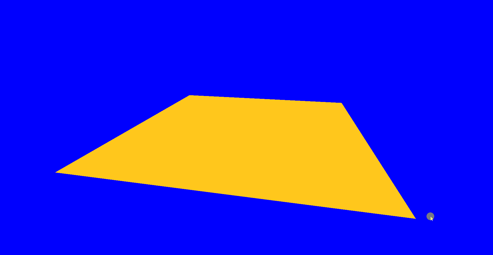

### Exercice : paramètres de la projection

Essayez de changer les paramètres de la matrice de projection (field of view, near plane) et essayez d'observer la différence de rendu. Essayez aussi d'utiliser une projection orthographique. (Je vous laisse chercher en ligne comment on fait ça avec glm).

### Exercice : model matrix

On peut rajouter un troisième matrice à la `view_projection_matrix`, pour former la `model_view_projection_matrix` ! (Attention, la model matrix doit s'appliquer en premier).

Avec `glm` vous pouvez créer une matrice de rotation avec

```cpp
glm::mat4 const rotation = glm::rotate(glm::mat4{1.f}, gl::time_in_seconds() /*angle de la rotation*/, glm::vec3{0.f, 0.f, 1.f} /* axe autour duquel on tourne */);
```
et une matrice de translation avec
```cpp
glm::mat4 const translation = glm::translate(glm::mat4{1.f}, glm::vec3{0.f, 1.f, 0.f} /* déplacement */);    
```

(Il faudra include `#include "glm/ext/matrix_transform.hpp"`.)

Créez une matrice modèle qui combine une translation et une rotation, et observez le résultat. Essayez les deux ordres (rotation suivie de translation, et vice-versa) et vous verrez que ce n'est pas pareil ! L'ordre a son importance !

## Cube

Maintenant qu'on peut voir en 3D, il est temps de faire notre premier mesh 3D ! Faites le vertex buffer et l'index buffer pour un cube. Je vous laisse [revoir le chapitre dédié au besoin](#index-buffer).<br/>
Je vous conseille de faire des petits schémas pour ne pas vous y perdre dans les indices, et y aller face par face.

:::tip Attention
Pensez à modifier aussi votre shader, pour qu'il reçoive une position 3D et plus 2D.
:::

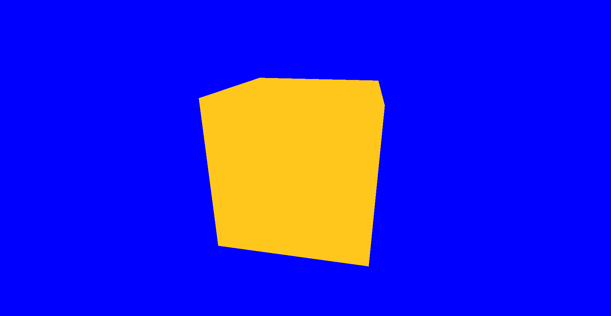

## Premier shader pour mieux voir la 3D

On a du mal à discerner la 3D sur notre cube monochrome. Nous allons donc changer notre fragment shader pour commencer à un peu mieux voir tout ça.

Une manière très simple va être de passer la position des vertexs du vertex shader vers le fragment shader, puis d'utiliser ces positions comme des couleurs, afin que chaque vertex ait une couleur différente.

Pour cela dans le vertex shader nous allons déclarer une variable `out`, qui sera transmise au fragment shader automatiquement :

```glsl title="res/vertex.glsl"
// À mettre avant le main
out vec3 vertex_position;
```

puis on l'assigne dans le main :

```glsl title="res/vertex.glsl"
vertex_position = in_position;
```

et ensuite dans le fragment shader on déclare un variable `in` avec le même nom et le même type que la variable `out` de notre vertex shader :

```glsl title="res/fragment.glsl"
// À mettre avant le main
in vec3 vertex_position;
```

et on peut l'utiliser dans notre main :

```glsl title="res/fragment.glsl"
out_color = vec4(vertex_position, 1.);
```

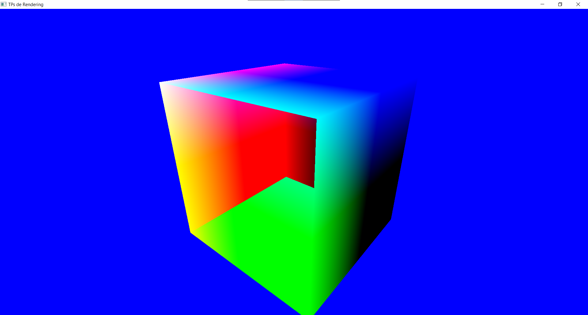

Si votre cube vous paraît un peu bizarre, c'est normal, il nous manque encore un Depth Buffer pour faire de la 3D correctement !

:::tip Note
Vous avez peut-être remarqué qu'il y a un dégradé de couleurs. C'est parce que, quand on passe une variable `in` / `out` entre le vertex shader et le fragment shader, elle est interpolée pour chaque pixel (en faisant une moyenne de la valeur aux trois sommets du triangle contenant le pixel).


:::

## Depth Buffer

Le problème avec notre rendu pour l'instant, c'est que les triangles se dessinent les uns après les autres et se recouvrent. Et si par malchance c'est une face arrière du cube qui est dessinée en dernière, alors elle va venir cacher les faces avant qui ont été dessinées avant.

Pour remédier à ça, il faut activer le Depth Test :

```cpp
// À mettre dans l'initialisation
glEnable(GL_DEPTH_TEST);
```

et clear le depth buffer à chaque frame, tout comme on clear la couleur de l'écran :

```cpp
glClear(GL_COLOR_BUFFER_BIT | GL_DEPTH_BUFFER_BIT); // Vient remplacer glClear(GL_COLOR_BUFFER_BIT);
```

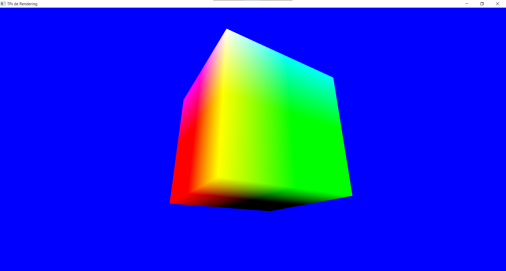

Et voilà ! Notre premier rendu 3D qui ressemble à peu près à quelque chose ! 🎉

Et qu'est-ce donc qu'un Depth Buffer au fait ? C'est une deuxième image, qui se crée en parallèle de la couleur qu'on met à l'écran, et qui stocke la profondeur correspondant à chaque pixel. Ainsi chaque triangle dessine à la fois une couleur à l'écran (contrôlée par le fragment shader), et aussi une "couleur" dans le depth buffer. Et avant même de dessiner, on vérifie pour chaque pixel si il n'y avait pas déjà eu quelque chose de dessiné sur ce pixel, et si oui on compare leur profondeur, et on recolorie le pixel avec la nouvelle couleur seulement si il est plus proche de la caméra que l'objet précédemment dessiné (on obtient cette distance à la caméra justement en allant lire le depth buffer).

On peut aller visualiser notre Depth Buffer dans RenderDoc :

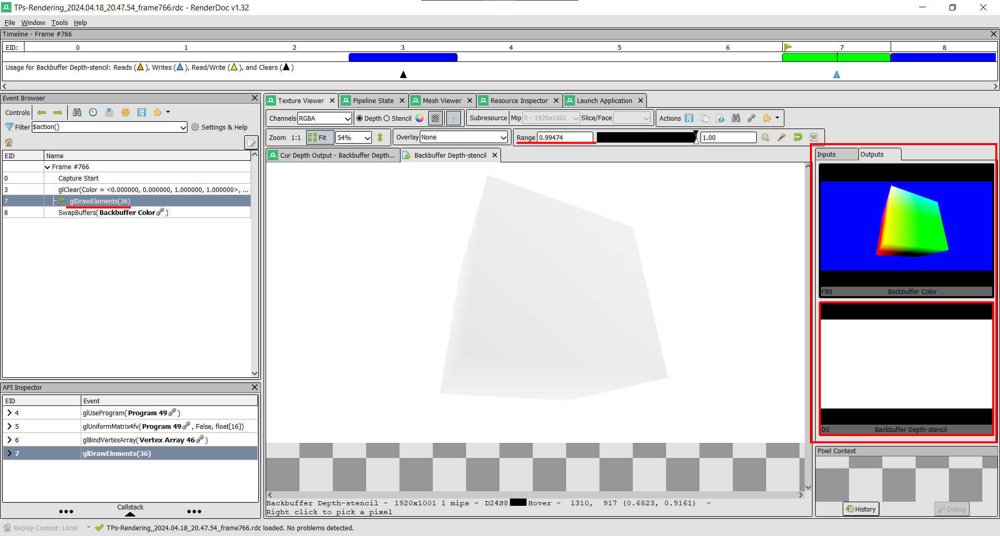

Dans l'onglet `Outputs` il y a maintenant deux images : l'écran normal (`Backbuffer Color`), et le Depth Buffer (`Backbuffer Depth-stencil`). (NB : pour y voir quelque chose dans le depth buffer, il faut changer la `Range`, car comme le cube est très proche il apparaît très blanc dans le depth buffer).

:::info Remarque
On verra un usage créatif du depth buffer pour faire un [effet de rendu See-Through](Partie%203%20-%20Du%20vrai%20rendu%203D#effet-see-through).
:::

## Texture

### UV

Nous allons maintenant appliquer une texture à notre objet ! Pour cela, il nous faut tout d'abord des coordonnées de texture, qui vont indiquer quelle partie de la texture s'applique à quelle partie du mesh. Pour l'instant revenez à un mesh de carré, et rajoutez un vertex attribute de type `UV`. Les coordonnées de texture sont souvent appelées UV (U pour l'axe X, et V pour l'axe Y), et vont de 0 à 1.<br/>
Pour vérifier que vos UVs sont bien placés, vous pouvez les afficher comme une couleur dans le fragment shader: `out_color = vec4(uv.x, uv.y, 0., 1.);`. C'est une technique très souvent utilisée pour débuguer sur GPU, comme on n'a pas de `print()` pour afficher des valeurs, on affiche des couleurs et on les interprète comme des nombres. Le rouge correspond à uv.x (0 à gauche et 1 à droite), et le vert à uv.y (0 en bas et 1 en haut). Ça doit ressembler à ça :

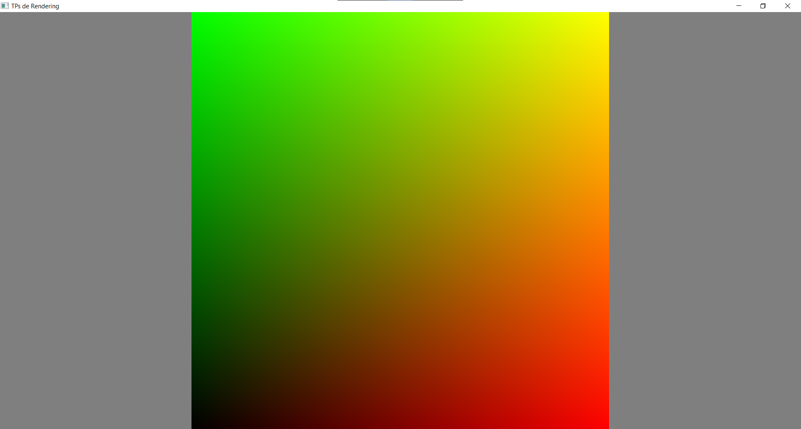

### Objet Texture

Une fois qu'on a nos UVs, on peut maintenant créer notre objet texture :
```cpp
auto const texture = gl::Texture{
    gl::TextureSource::File{ // Peut être un fichier, ou directement un tableau de pixels
        .path           = "res/texture.png",
        .flip_y         = true, // Il n'y a pas de convention universelle sur la direction de l'axe Y. Les fichiers (.png, .jpeg) utilisent souvent une direction différente de celle attendue par OpenGL. Ce booléen flip_y est là pour inverser la texture si jamais elle n'apparaît pas dans le bon sens.
        .texture_format = gl::InternalFormat::RGBA8, // Format dans lequel la texture sera stockée. On pourrait par exemple utiliser RGBA16 si on voulait 16 bits par canal de couleur au lieu de 8. (Mais ça ne sert à rien dans notre cas car notre fichier ne contient que 8 bits par canal, donc on ne gagnerait pas de précision). On pourrait aussi stocker en RGB8 si on ne voulait pas de canal alpha. On utilise aussi parfois des textures avec un seul canal (R8) pour des usages spécifiques.
    },
    gl::TextureOptions{
        .minification_filter  = gl::Filter::Linear, // Comment on va moyenner les pixels quand on voit l'image de loin ?
        .magnification_filter = gl::Filter::Linear, // Comment on va interpoler entre les pixels quand on zoom dans l'image ?
        .wrap_x               = gl::Wrap::Repeat,   // Quelle couleur va-t-on lire si jamais on essaye de lire en dehors de la texture ?
        .wrap_y               = gl::Wrap::Repeat,   // Idem, mais sur l'axe Y. En général on met le même wrap mode sur les deux axes.
    }
};
```
*[Si vous voulez, vous pouvez télécharger cette texture de test.](./img/texture.png)*

Nous testerons les différentes `TextureOptions` juste après, mais déjà pour afficher la texture il ne vous reste plus qu'à :
- Déclarer une variable uniforme de type `sampler2D` dans le fragment shader. (Un sampler est l'objet qui nous permet d'accéder à la texture en appliquant les TextureOptions qu'on a choisies) : `uniform sampler2D my_texture;`
- Passer la texture au shader via une variable uniforme : `shader.set_uniform("my_texture", texture);`
- De nouveau dans le fragment shader, lire la texture à la position `uv` grâce à la fonction `texture()` de glsl : `vec4 texture_color = texture(my_texture, uv);` et la retourner en sortie du fragment shader.

*Et voilà !*
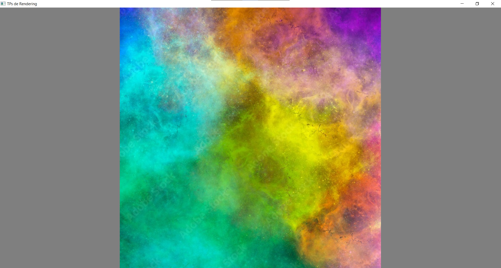

### Options de texture

#### Wrap

Le mode de wrapping contrôle ce qu'il se passe quand on passe des UVs à la fonction `texture()` qui ne sont pas entre 0 et 1. Plutôt que de crash comme le ferait un tableau normal quand on utilise un index invalide (< 0 ou >= size), la texture va quand même retourner une couleur. Pour tester ces différents modes, utilisez des UVs qui vont de -1 à 2, et testez tous les modes ! Vous verrez que les noms sont plutôt explicites. (PS : pour le mode `ClampToBorder` il faut spécifier le paramètre `border_color` en plus dans `TextureOptions`).

*gl::Wrap::MirroredRepeat*
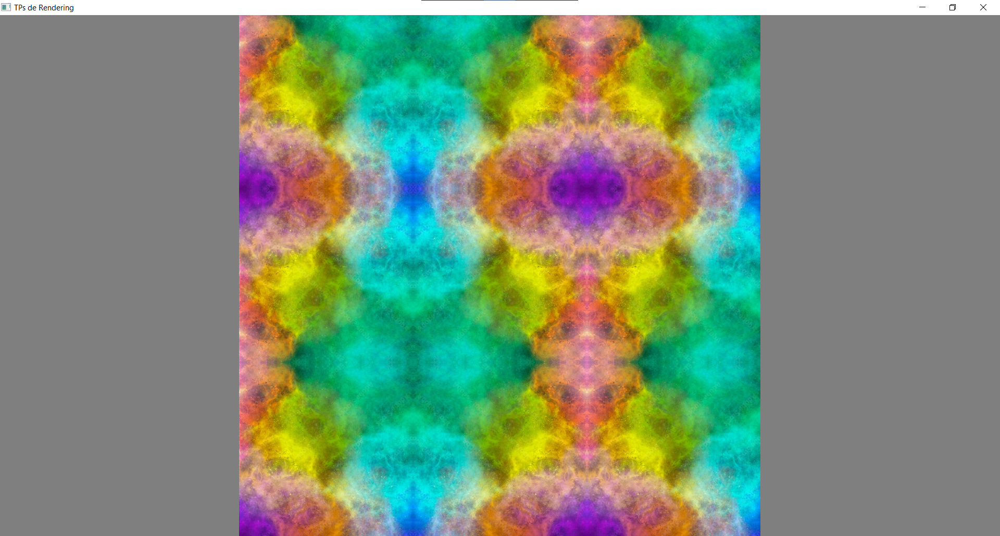

#### Filter

Le filtre de magnification contrôle ce qu'il se passe quand on zoome dans l'image. Pour en visualiser l'effet, utilisez des UVs qui vont de 0.8 à 0.9 par exemple.

:::info Note
Pour le filtre `LinearMipmapLinear` il faut avoir créé des mipmaps pour votre texture, nous en parlerons plus tard.
:::

*gl::Filter::NearestNeighbour*
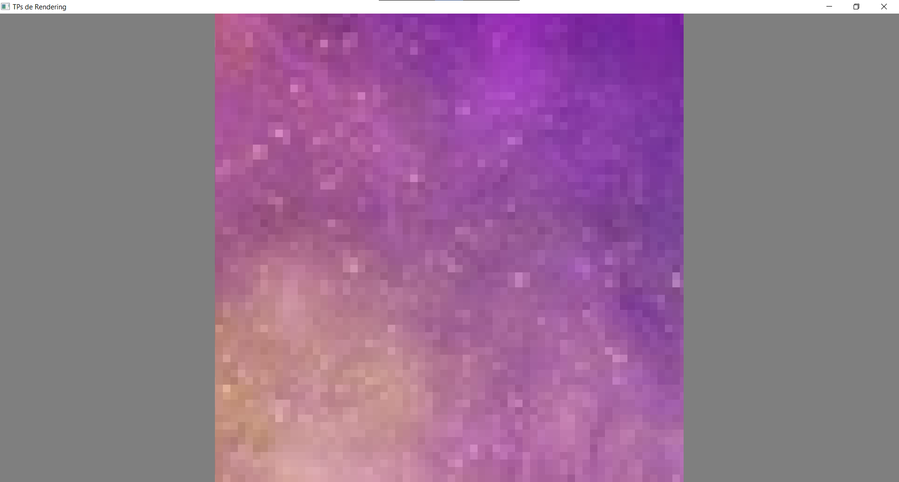

Le filtre de magnification est utilisée quand la texture est vue de loin et couvre "peu" de pixels à l'écran (moins que le nombre de pixels dans la texture).

L'effet du filtre est beaucoup moins visible, et c'est surtout quand il y a du mouvement que le filtre Linear peut éviter un peu de flicker. Vous pouvez le voir [en utilisant une texture d'échiquier](./img/checkerboard.jpg), des UVs entre 0 et 30, et en faisant déplacer la texture à une vitesse de 0.0001 par seconde.

### Bonus : textures procédurales

Il est aussi possible, au lieu de lire une texture, de colorier un triangle en calculant une "texture" procédurale en fonction des UVs. On en a déjà vu un exemple très simple quand on affiché nos UVs (`out_color = vec4(uv.x, uv.y, 0., 1.);`), mais on peut faire beaucoup plus ! Par exemple toutes les images sur [Shadertoy](https://www.shadertoy.com/) sont faites ainsi, juste en affichant un quad sur tout l'écran, et en faisant des calculs élaborés dans le fragment shader.

<iframe width="640" height="360" frameborder="0" src="https://www.shadertoy.com/embed/Wt33Wf?gui=true&t=10&paused=true&muted=false" allowfullscreen></iframe>

Pour commencer simplement, vous pouvez vous demander comment produire un disque, ou un pattern d'échiquier :

| 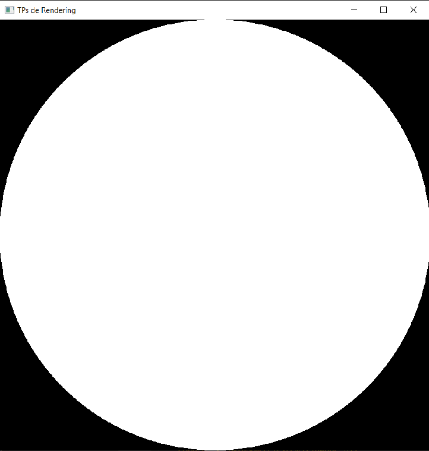      | 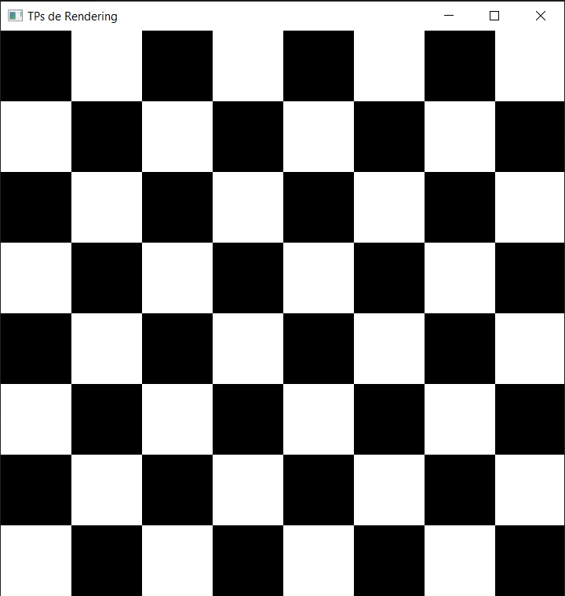  |  
| ----------- | ----------- |

Pour aller plus loin, je vous recommande les excellentes vidéos de [The Art of Code](https://youtu.be/u5HAYVHsasc?list=PLGmrMu-IwbguU_nY2egTFmlg691DN7uE5) :

<YoutubeVideo id="u5HAYVHsasc?list=PLGmrMu-IwbguU_nY2egTFmlg691DN7uE5" />

### Cube texturé

Vous pouvez maintenant reprendre votre mesh de cube, et lui rajouter des UVs pour pouvoir appliquer une texture. Vous remarquerez qu'on ne peut pas avoir la texture qui s'affiche bien sur les 6 faces à la fois. Du moins tant qu'on n'utilise que 8 vertexs. En effet, utiliser un index buffer c'est bien pratique, mais parfois on a besoin de dupliquer nos sommets afin d'avoir un attribut différent pour chaque face même si elles partagent un même sommet. Par exemple ici nos sommets partagent la même position, mais pas les mêmes UVs en fonction de la face qu'on considère. Ne vous embêtez pas à le faire, mais sachez que pour résoudre ce problème dans le cas de notre cube il faudrait se passer d'un index buffer, et re-préciser les sommet une fois pour chaque triangle, comme on le faisait au début. (Donc 36 sommets dans le cas de notre cube !)

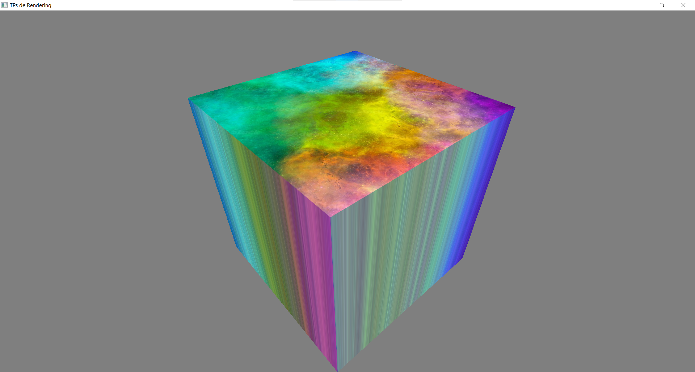

## Render Target

Pour finir ce long chapitre sur les différents objets fondamentaux des moteurs de rendu 3D, nous allons parler des Render Targets ! (Aussi appelées **Framebuffers**).

Une Render Target sert à faire notre rendu sur une texture à part, au lieu de le faire directement à l'écran. Ça peut être très utile quand on a besoin de réutiliser l'image produite, par exemple pour appliquer du post-processing dessus.

Commencez par créer une Render Target : vous reconnaîtrez certains paramètres qu'on a déjà utilisés en [créant une texture](#objet-texture) :

```cpp
auto render_target = gl::RenderTarget{gl::RenderTarget_Descriptor{
    .width          = gl::framebuffer_width_in_pixels(),
    .height         = gl::framebuffer_height_in_pixels(),
    .color_textures = {
        gl::ColorAttachment_Descriptor{
            .format  = gl::InternalFormat_Color::RGBA8,
            .options = {
                .minification_filter  = gl::Filter::NearestNeighbour, // On va toujours afficher la texture à la taille de l'écran,
                .magnification_filter = gl::Filter::NearestNeighbour, // donc les filtres n'auront pas d'effet. Tant qu'à faire on choisit le moins coûteux.
                .wrap_x               = gl::Wrap::ClampToEdge,
                .wrap_y               = gl::Wrap::ClampToEdge,
            },
        },
    },
    .depth_stencil_texture = gl::DepthStencilAttachment_Descriptor{
        .format  = gl::InternalFormat_DepthStencil::Depth32F,
        .options = {
            .minification_filter  = gl::Filter::NearestNeighbour,
            .magnification_filter = gl::Filter::NearestNeighbour,
            .wrap_x               = gl::Wrap::ClampToEdge,
            .wrap_y               = gl::Wrap::ClampToEdge,
        },
    },
}};
```

En général une Render Target a plusieurs textures (qu'on appelle des *attachments*) : au moins une texture de couleur[^1], et (optionnellement) une texture de profondeur (le fameux [Depth Buffer](#depth-buffer)) (qui peut aussi contenir un [Stencil Buffer](TODO) dont nous reparlerons plus tard).

[^1]: Il peut y en avoir plusieurs. Ça permet de dessiner sur plusieurs textures en même temps avec un seul draw call. Pour cela il suffit dans le fragment shader de déclarer plusieurs variables `out`: `layout(location = 0) out vec4 out_color1; layout(location = 1) out vec4 out_color2;` et d'écrire dans chacune d'elles.

Puisque dans notre cas on va utiliser la render target pour faire du post-processing, on veut que la texture aie la même taille que l'écran. C'est pourquoi on l'initialise avec 
```cpp
.width  = gl::framebuffer_width_in_pixels(),
.height = gl::framebuffer_height_in_pixels(),
```

mais il faut également la changer si la fenêtre est redimensionnée ! Rajoutez cet event callback :

```cpp
gl::set_events_callbacks({
    camera.events_callbacks(),
    {.on_framebuffer_resized = [&](gl::FramebufferResizedEvent const& e) {
        if(e.width_in_pixels != 0 && e.height_in_pixels != 0) // OpenGL crash si on tente de faire une render target avec une taille de 0
            render_target.resize(e.width_in_pixels, e.height_in_pixels);
    }},
});
```

Maintenant que notre render target est créée, on peut dessiner dessus. Pour cela, il suffit d'appeler sa méthode `render()` et de lui passer un callback contenant du code de dessin normal. Ces draw calls dessineront non pas à l'écran, mais sur notre render target !

```cpp
 render_target.render([&]() {
    glClearColor(1.f, 0.f, 0.f, 1.f); // Dessine du rouge, non pas à l'écran, mais sur notre render target
    glClear(GL_COLOR_BUFFER_BIT | GL_DEPTH_BUFFER_BIT);
    // ... mettez tout votre code de rendu ici
});
```

En faisant ça on ne voit plus rien à l'écran, et c'est normal car tout est maintenant mis sur notre render target à la place. Nous allons l'afficher dans un instant, mais en attendant on peut déjà aller la voir dans RenderDoc et confirmer que le rendu s'est bien fait :
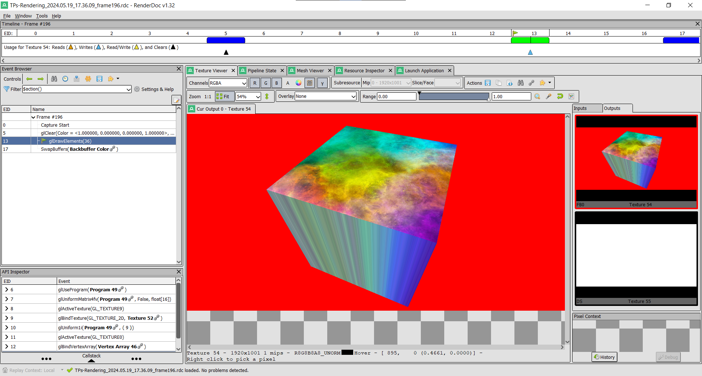

Notre cube est toujours là, mais au lieu d'être rendu à l'écran (qui s'appelait `Backbuffer Color` dans notre capture RenderDoc), la texture d'output est maintenant `Texture 54`.

Maintenant pour afficher notre texture, il nous suffit de dessiner un quad sur tout l'écran, de passer la texture à un shader, et de la lire [comme au chapitre sur les textures](#objet-texture) :

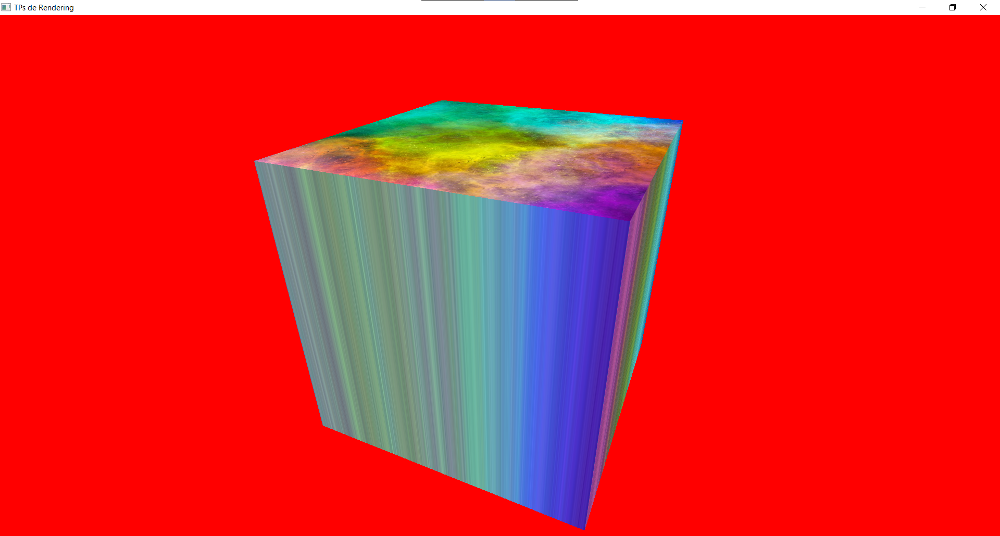

Et voilà ! On est revenu au point de départ avec notre cube, mais l'avantage c'est qu'on peut maintenant manipuler la texture comme on veut dans un shader et appliquer plein d'effets !

### Post-Process

Dans le fragment shader qui lit la texture de la render target, on peut maintenant manipuler la couleur comme on veut ! Essayez de tout passer en noir et blanc, ou de ne garder que la composante rouge de l'image :

| 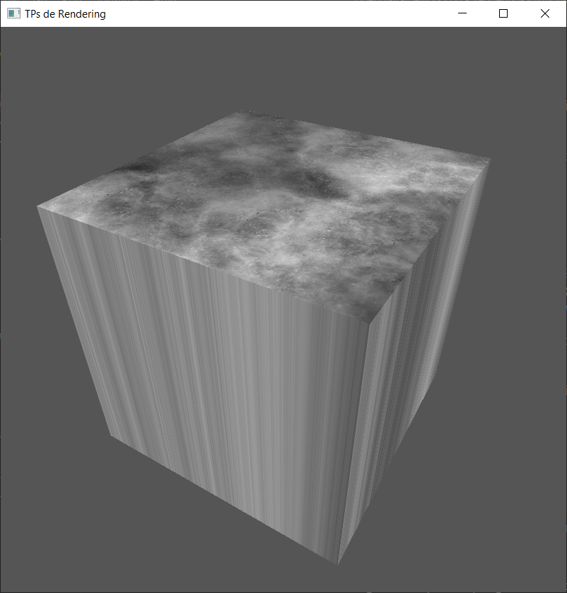      | 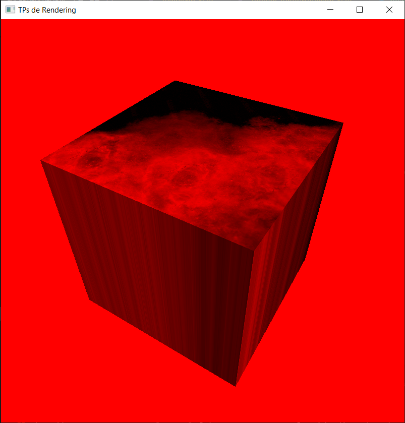  |  
| ----------- | ----------- |

**Bonus :** Vous pouvez aussi tenter plein d'autres effets, comme augmenter le contraste ou la saturation de l'image, faire du vignettage, déformer l'image, etc.

### Bonus : Fade

Utiliser une render target peut aussi permettre de choisir le format (e.g. `RGBA8`) de la texture sur laquelle on rend, au lieu d'être limité à la valeur choisie par défaut par OpenGL. Reprenez votre code du [fade](#bonus--effet-de-fade), et faites maintenant le rendu sur une render target utilisant un format avec 16 ou 32 bits par canal au lieu de 8, ça va régler les problèmes de précision qu'on avait. Et le fait d'utiliser une render target règle aussi le problème de swapchain qui faisait clignoter l'image.


### Autres utilisations

:::tip Note
Sur ce schéma du pipeline de rendu d'Unreal, la plupart des étapes intermédiaires stockent leur résultat dans une render target, qui sont ensuite réutilisées par d'autres étapes. Ça vous donne une idée du nombre de render targets utilisées !


:::