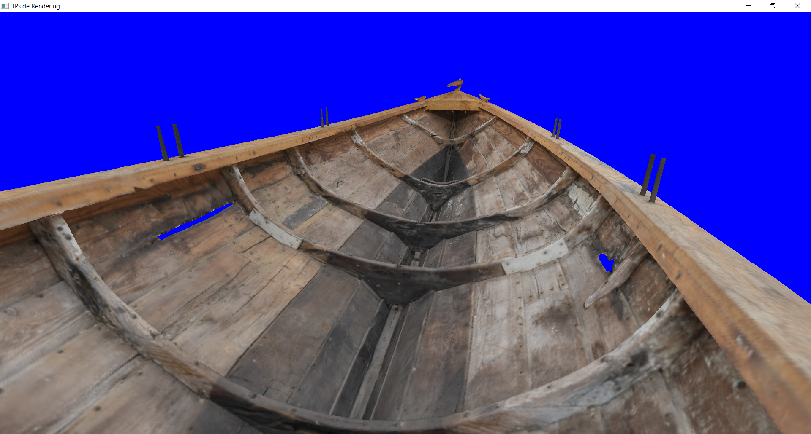
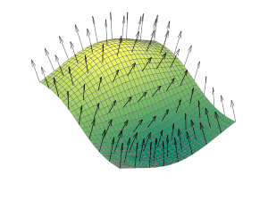
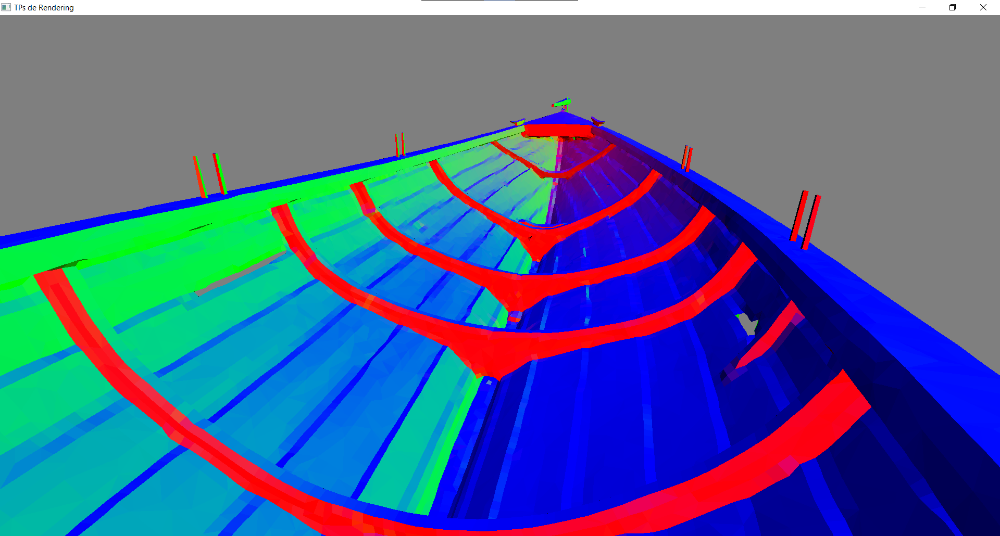
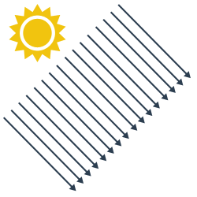
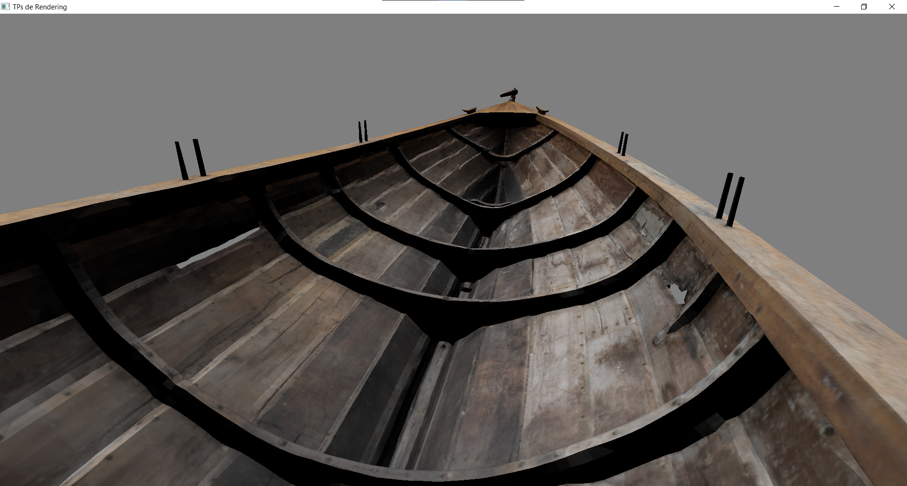
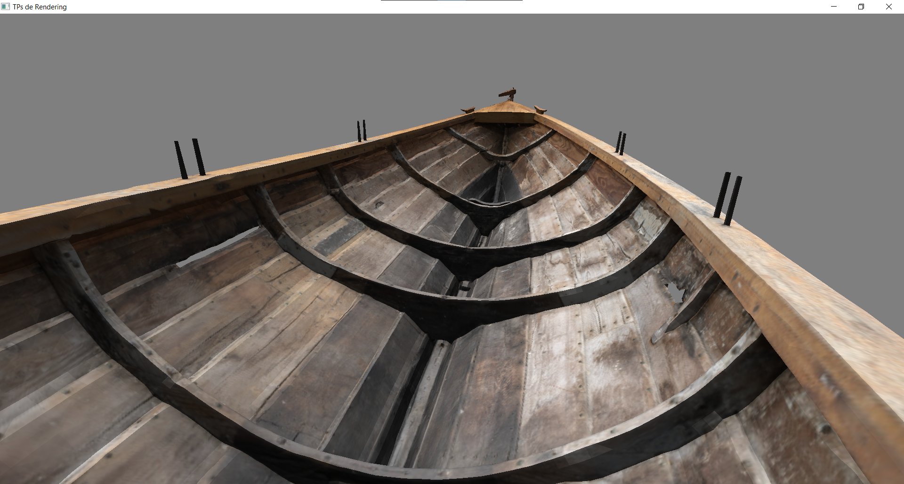
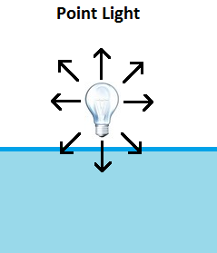
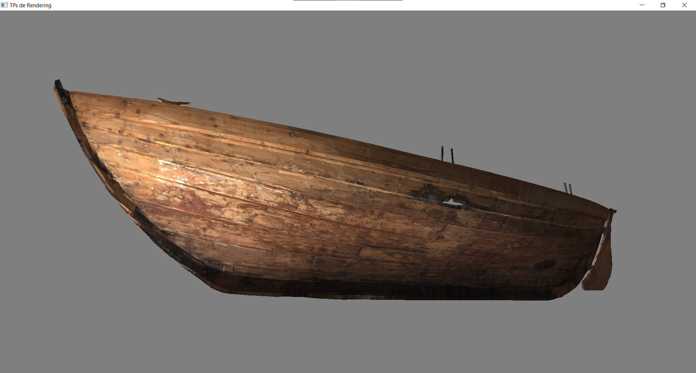
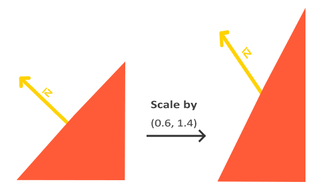

## Charger un mesh depuis un fichier

Pour commencer, nous allons enfin utiliser de vrais modèles 3D. Pour cela, nous allons utiliser la librairie [*tinyobjloader*](TODO) qui lit le format de fichier *.obj* (un format simple de modèle 3D, qui est essentiellement une longue liste de sommets avec positions, UVs, normales, etc.). La librairie est déjà inclue par *opengl-framework*, vous n'avez rien à faire de ce côté là. Je vous laisse vous référer à [la documentation de *tinyobjloader*](TODO) pour voir comment l'utiliser pour lire un modèle 3D. Pour vos tests, vous pouvez utiliser [ce modèle 3D](/fourareen.zip).

**NB:** vous aurez besoin de la fonction `gl::make_absolute_path(path)` pour convertir un chemin relatif (par exemple `"res/meshes/fourareen.obj"` en un chemin absolu que *tinyobjloader* va comprendre).



:::tip
N'essayez pas de faire un index buffer, les sommets tels qu'ils sont donnés par *tinyobjloader*  ont un index buffer différent pour chaque attribut, ce qui n'est pas supporté par OpenGL. Il faudrait plutôt inspecter tous les sommets pour détecter ceux qui ont les mêmes positions **et** UVs **et** normales et recréer notre propre index buffer à partir de ça.
:::

:::tip
Si votre modèle est penché sur le côté au début, c'est "normal". Il n'y a pas de convention universelle pour l'axe qui pointe vers le haut : certain.es utilisent Y, et d'autres Z. Il faudra donc légèrement modifier les vertexs du mesh afin de faire pointer le bon axe vers le haut.
:::

:::info Note
Il y a aussi un fichier *.mtl* dans le modèle que je vous ai fourni. Il décrit le matériau de l'objet, nous en parlerons [plus tard](TODO).
:::

## Premier modèle d'éclairage et Normales

### Normales

Nous allons maintenant commencer à éclairer plus ou moins nos objets en fonction des différentes lumières présentes dans la scène. Tout va se passer dans le fragment shader, qui va être responsable de faire ces calculs pour chaque pixel, et d'atténuer plus ou moins la couleur de base du pixel (appelée **albedo**) en fonction de la quantité de lumière reçue.

Pour faire ces calculs de lumière, nous avons besoin de connaître l'orientation de notre surface (pour savoir à quel point elle est face à la lumière) et c'est à ça que servent les **normales** :



La normale est le vecteur perpendiculaire à la surface ; on pourrait le calculer à la volée en connaissant les trois sommets du triangle, mais il est le plus souvent précalculé et stocké dans le vertex buffer. Par exemple dans le *.obj* que nous utilisons, les normales sont déjà stockées dans le fichier, en plus des positions et des UVs. Rajoutez les normales dans votre vertex buffer, et dans un premier temps pour vérifier qu'elles sont bonnes, affichez les en tant que couleur de l'objet :



On peut interpréter les couleurs : RGB = XYZ : en bleu ce sont les normales qui pointent vers Z, i.e. vers le haut. En rouge et vert sont celles qui pointent vers X et Y.


TODO normaliser les normales
TODO normal matrix

### Lumière directionnelle

Maintenant il nous faut décrire notre lumière. Nous allons commencer par le type le plus simple, les lumières directionnelles. C'est une lumière qui éclaire dans une seule direction ; c'est typiquement le cas du soleil (ou toute autre source très éloignée), dont tous les rayons nous arrivent (quasiment) parallèles :



Pour la décrire il nous suffit de donner sa direction, qui sera un `vec3` normalisé (i.e. de longueur 1). On peut soit la mettre en constante dans le fragment shader `const vec3 light_direction = normalize(vec3(0.2, 0.3, -1.));`, soit la passer en uniform `uniform vec3 light_direction;` (ce qui est l'option la plus courante, car on veut pouvoir changer la direction de notre lumière sans avoir à recréer un nouveau shader à chaque fois).<br/>
Une fois que vous avez cette direction, pour mesurer à quel point notre triangle fait face à la lumière (et donc à quel point il est éclairé) nous allons utiliser le *produit scalaire* (`dot(v1, v2)` en glsl). Le produit scalaire entre deux vecteurs parfaitement alignés vaut 1 (si les vecteurs sont normalisés), il vaut -1 si les vecteurs sont parfaitement opposés, et il vaut 0 si les vecteurs sont orthogonaux. On peut ensuite multiplier la couleur de notre pixel par le résultat de ce produit scalaire (avec un signe moins), ce qui va nous donner un premier modèle d'éclairage simpliste : Quand la normale et la direction de la lumière sont parfaitement opposées c'est l'éclairage maximal, et on va multiplier par un produit scalaire qui vaut 1, donc conserver toute la couleur du pixel. À l'inverse quand les vecteurs sont perpendiculaires aucune lumière n'arrive sur notre surface, et ça correspond bien au fait de multiplier par un produit scalaire qui vaut 0 dans ce cas.



### Lumière ambiante

Un premier défaut qu'on peut tout de suite voir c'est que certaines parties du bateau sont complètement noires, car elles sont à l'opposé de la lumière. Ce n'est pas très réaliste, car dans la vraie vie même si on n'est pas directement exposé à la lumière celle-ci rebondit sur les objets environnants et vient éclairer un peu partout. C'est ce qui s'appelle de **l'illumination globale**. Il y a des techniques pour simuler ça dans les moteurs de jeu, mais ça devient assez complexe. Pour faire simple on peut juste rajouter un terme de **lumière ambiante** qui va faire une approximation de cette illumination globale. Il suffit d'additionner un petit quelque chose (`0.3` par exemple) à notre produit scalaire, pour l'empêcher de tomber jusqu'à 0 (et aussi, si le produit scalaire devient négatif, il faut le limiter à 0, afin que notre `+0.3` ait de l'effet dans toutes les zones noires, et pas seulement dans celles où le produit scalaire est `> -0.3`).



### Lumière ponctuelle

Un autre type de lumière assez simple est la lumière ponctuelle. Elle est décrite par une position (`vec3`) et illumine de manière égale dans toutes les directions autour d'elle. C'est typiquement le cas des ampoules et autres petites sources de lumière.



Le calcul d'éclairage est le même que pour une lumière directionnelle. Mais il nous faut d'abord calculer la direction de la lumière, qui cette fois-ci dépend de la position du pixel concerné. Il faut donc récupérer la position dans le fragment shader, puis calculer le vecteur entre la position du pixel et la position de la lumière. De plus, l'intensité d'une lumière ponctuelle décroît à mesure qu'on s'en éloigne, donc il faut diviser le tout par la distance au carré[^1].

[^1]: C'est dû au principe physique de conservation d'énergie : à un instant *t* la source émet une certaine quantité d'énergie, et cette énergie s'éloigne de la source, formant une sphère de plus en plus grande. Comme la même quantité d'énergie doit être présente sur une sphère de plus en plus grande, l'énergie en un point donné doit décroître proportionnellement à la surface de la sphère, soit $R^2$.



:::tip
Pour contrôler l'influence des différentes lumières, vous pouvez leur rajouter une intensité (a.k.a. un nombre que vous allez multiplier au résultat du produit scalaire) afin d'augmenter ou diminuer l'effet d'une lumière.
:::

### Normal Matrix et Model Matrix

Si on se met à appliquer une matrice modèle à notre objet, par exemple pour le faire tourner, on se rend compte d'un petit problème :


L'éclairage ne prend pas en compte la transformation de notre objet ! C'est comme si il ne tournait pas aux yeux de la lumière ! C'est parce que les positions et normales qu'on récupère depuis le vertex buffer sont exprimées en Object Space, alors que la position / direction de notre lumière est en World Space. Pour pouvoir faire nos calculs il faut que tout soit exprimé dans le même repère ! Pour convertir les positions et normales de nos pixels depuis l'Object Space vers le World Space, il faut leur appliquer la Model Matrix. Et je vous donne ces deux fonctions pour appliquer correctement une matrice à une position et à une direction en prenant bien en compte les coordonnées homogènes :

```glsl
vec3 apply_matrix_to_position(mat4 matrix, vec3 point)
{
    vec4 tmp = matrix * vec4(point, 1.);
    return tmp.xyz / tmp.w;
}

vec3 apply_matrix_to_direction(mat4 matrix, vec3 direction)
{
    vec4 tmp = matrix * vec4(direction, 0.);
    return normalize(tmp.xyz);
}
```


:::tip
Pour éviter toute confusion à l'avenir, je vous conseille de toujours ajouter un petit suffixe à vos variables de position et direction, pour bien indiquer dans quel espace elles sont exprimées : par exemple `_os` pour object space, `_ws` pour world space, `_vs` pour view space, etc.

```glsl
layout(location = 0) in vec3 in_position_os;
uniform mat4 model_matrix;

out vec3 position_ws;
// ...

void main()
{
    // ...
    position_ws = apply_matrix_to_position(model_matrix, in_position_os);
    // ...
}
```
:::

De plus, ce n'est pas tout à fait la Model Matrix qu'il faut appliquer aux normales, mais la **Normal Matrix**, qui est l'inverse de la transposée de la Model Matrix (`glm::inverse(glm::transpose(model_matrix))`). Ça revient au même dans la plupart des cas, mais si jamais il y a une scale non-uniforme dans votre model matrix, alors ça déformerait les normales et il faut passer par la Normal Matrix pour corriger ça.

<br/>
*Normales incorrectement transformées par la Model Matrix*

Si vous voulez savoir d'où vient la normal matrix et pourquoi c'est l'inverse de la transposée, je vous recommande [ce petit article](http://www.lighthouse3d.com/tutorials/glsl-12-tutorial/the-normal-matrix/).

### Lumières colorées

couleur et intensité de la lmuière

matrice modèle à appliquer aux positions, et normal matrix

### Blinn-Phong, material, etc

## Normal maps

## Ombres

## Effet see-through

-> depth buffer