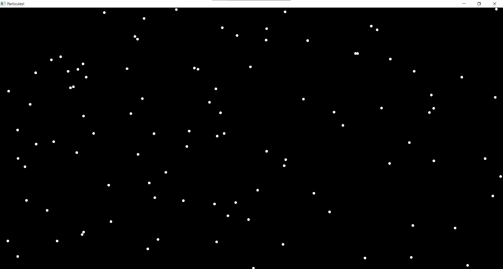
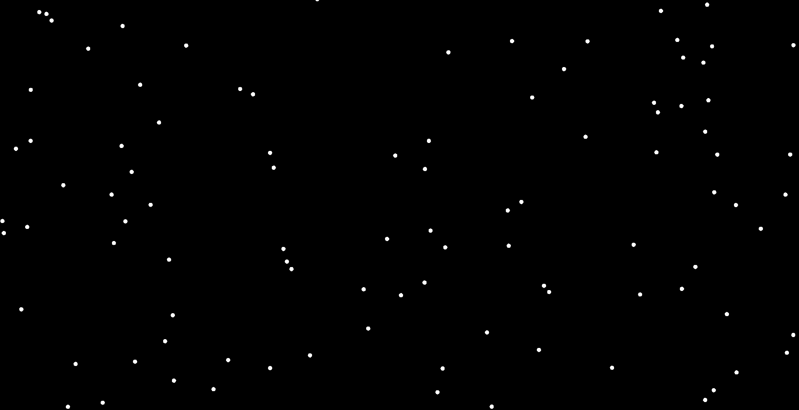
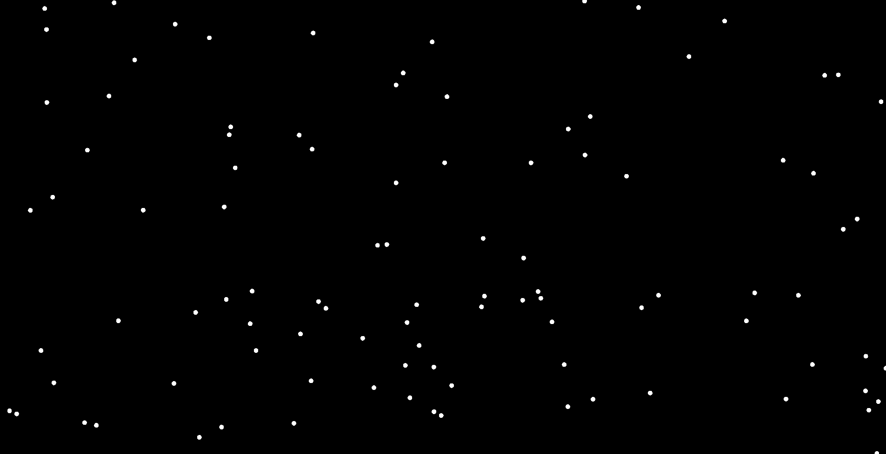
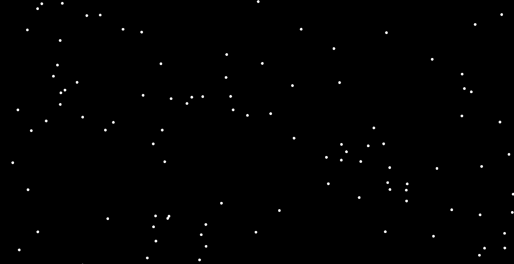
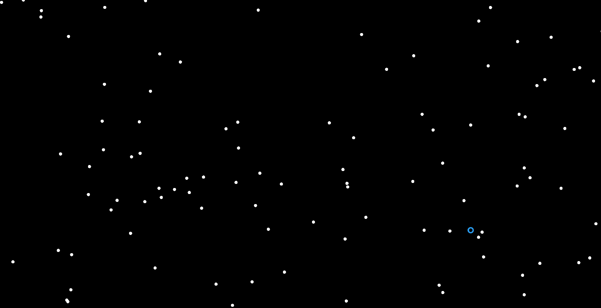
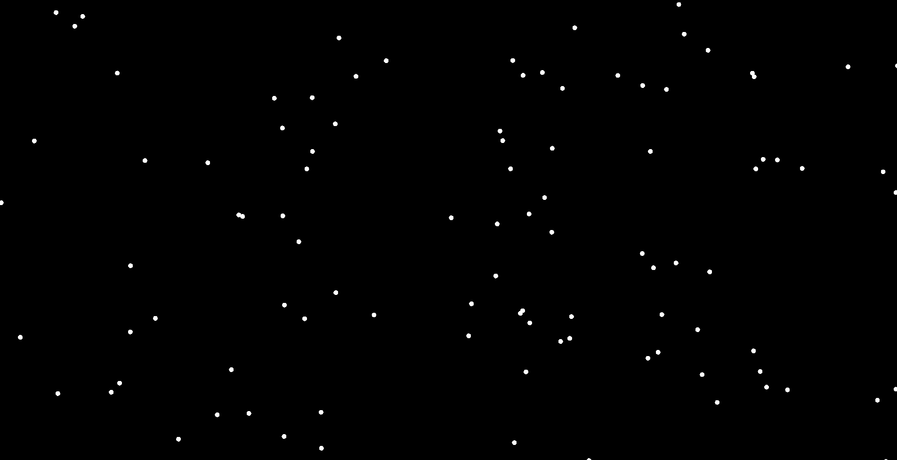
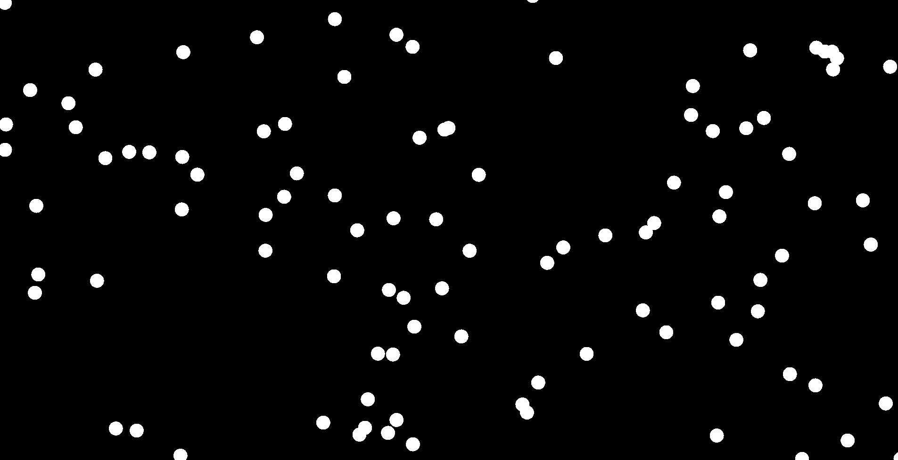
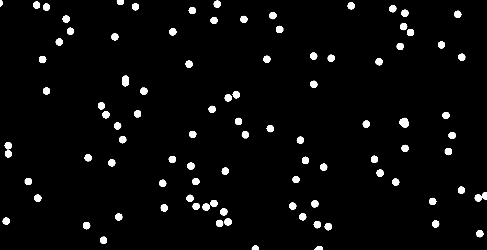
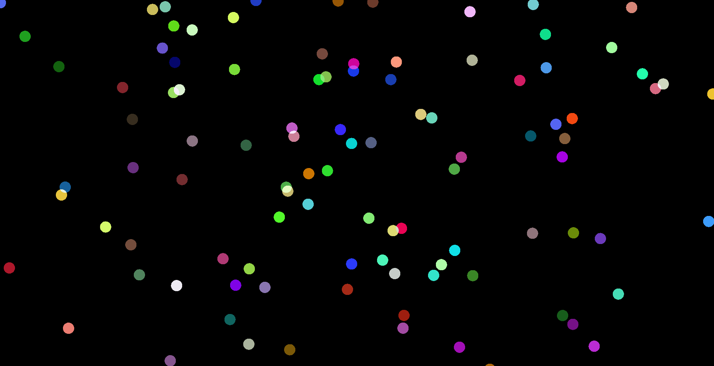
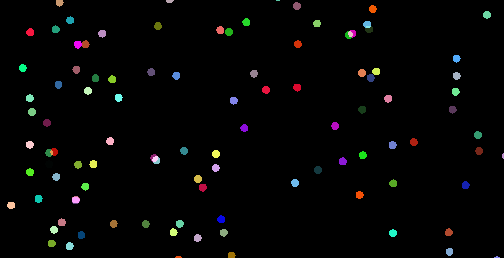

## Setup initial

- Créez une struct `Particle`, qui contiendra pour l'instant simplement une position choisie aléatoirement (vous pouvez utiliser `utils::rand(min, max)`)

:::tip
Pour les vecteurs nous utilisons la librairie `glm`, qui contient entre autre le type `glm::vec2`. Les opérateurs `+`, `-`, `*` marchent sur ces vecteurs, ainsi que diverses fonctions: `glm::dot(v1, v2)` (produit scalaire), `glm::length(v)`, etc.
:::

:::tip
- L'axe X va de gauche à droite, de `-gl::window_aspect_ratio()` à `+gl::window_aspect_ratio()`
- L'axe Y va de bas en haut, de `-1` à `+1`
:::

- Créez un `std::vector<Particle>` avec une centaine de particules
- Affichez les grâce à `utils::draw_disk(position, radius, color)` (nous ferons varier le radius et la color plus tard, pour l'instant choisissez des valeurs hardcodées)

## Forces

- Rajoutez maintenant une **vitesse** à vos particules, initialisée avec un angle et une longueur aléatoire (Tip: il va falloir faire de la trigo pour convertir cet angle et cette longueur en un vec2, aka convertir des coordonnées polaires en coordonnées cartésiennes)
- À chaque frame, appliquez cette vitesse à la position de vos particules pour les faire bouger (attention à bien prendre en compte le delta time ! `gl::delta_time_in_seconds()`

Nous allons maintenant appliquer des forces à nos particules :

- Calculez une force de gravité (un vecteur constant vers le bas, multiplié par la masse de la particule (il faut donc ajouter une `mass` à votre particule))
- Calculez l'accélération, qui est égale à la somme des forces, divisée par la masse de la particule
- Appliquez cette accélération à la vitesse (avant d'appliquer la vitesse à la position)

Nous pouvons maintenant rajouter d'autre forces :

- [Frottements de l'air](https://www.wikiwand.com/fr/articles/Frottement_fluide#%C3%80_faible_vitesse) (on considérera qu'on est toujours dans le cas "à faible vitesse")

- [Force de ressort](https://www.techno-science.net/definition/6765.html) attaché à la position de la souris `gl::mouse_position()` (autrement dit une force proportionnelle au vecteur qui va de la particule vers la souris)

- *Pour aller plus loin*: force de vortex, qui fait tourner les particules en rond autour d'un certain point

## Durée de vie

- Rajoutez une durée de vie à vos particules (initialisée aléatoirement) et un âge qu'il faudra augmenter à chaque frame
- Dès que l'âge d'une particule dépasse sa durée de vie, supprimez-la

## Interpolation au cours de la vie

- Diminuez le rayon de la particule en fonction de son âge, afin d'atteindre 0 quand elle meurt

- Au lieu d'avoir le rayon qui diminue constamment, faites en sorte que ce soit seulement dans les deux dernières secondes de sa vie qu'il diminue (essayez de ne pas utiliser de `if` ! Juste des fonctions mathématiques et un min ou un max)

<!-- - Au lieu de choisir arbitrairement une masse, elle devrait être proportionnelle à la taille de la particule: Au lieu de stocker la masse de la particule, faites une méthode qui la calcule, de sorte qu'elle soit proportionnelle à l'**aire** de la particule -->
- Choisissez une couleur de début et une couleur de fin, et faites varier la couleur de la particule au cours de sa vie

## Easing

- Utilisez une [fonction de easing](https://www.tumblr.com/1ucasvb/44666043888/easing-functions-are-an-immensely-useful-tool-for) (par exemple un bounce) sur le radius de la particule pour la faire clignoter avant qu'elle meure

- Utilisez une fonction de easing (par exemple power) pour adoucir le début et la fin de l'animation de changement de couleur
