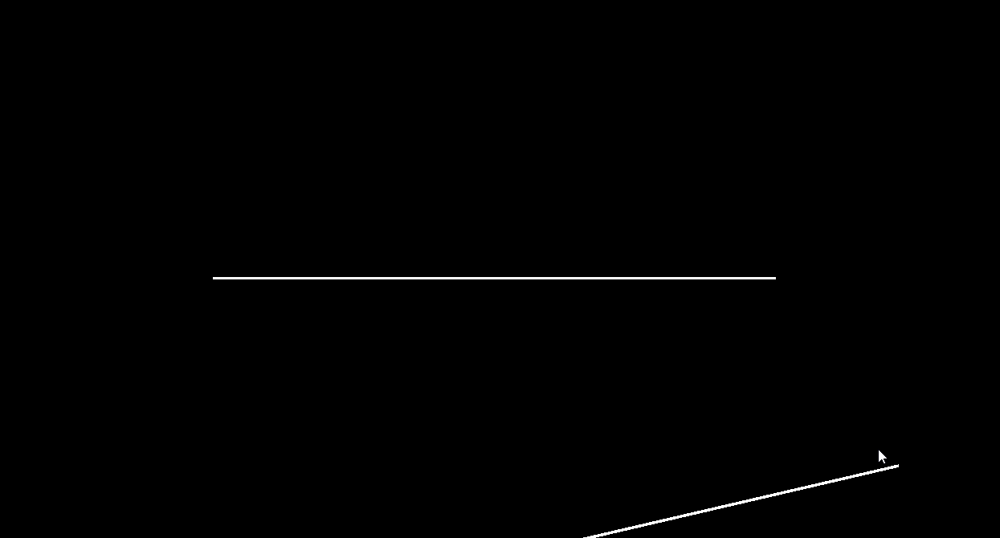
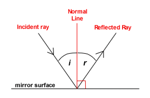
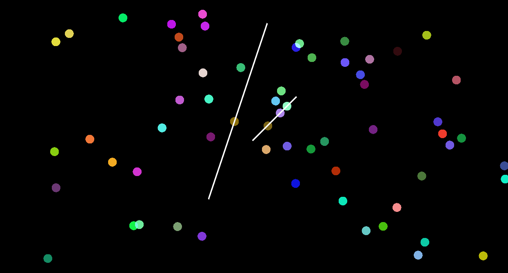
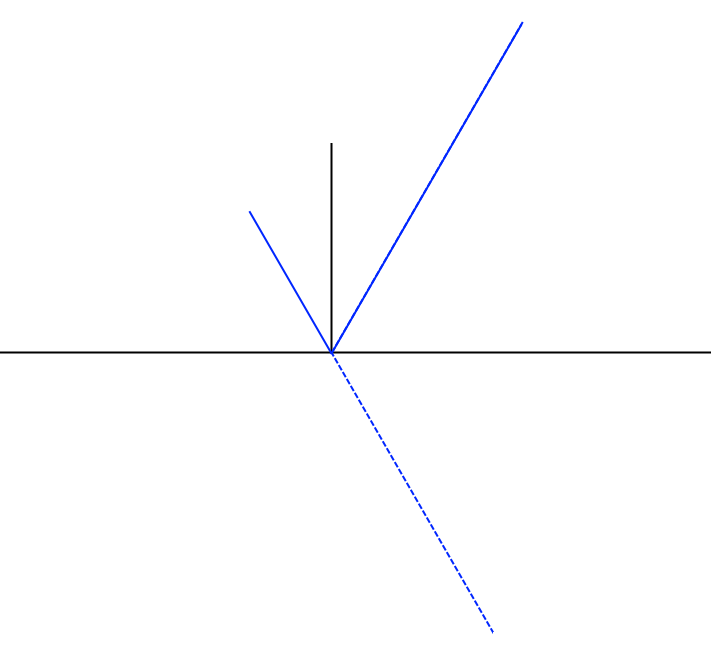
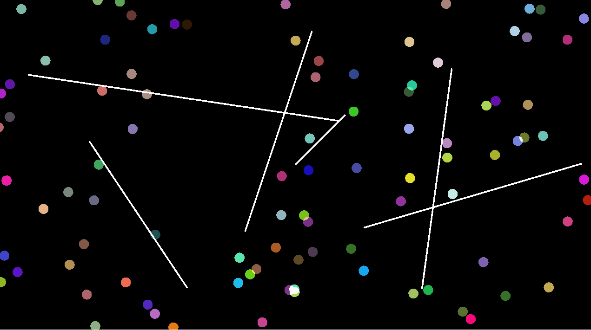
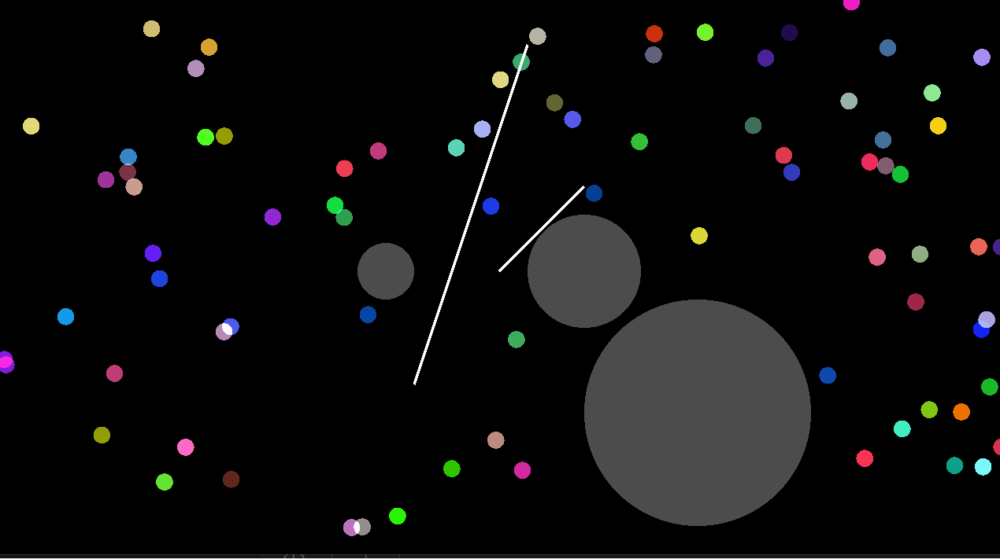

- J'ai rajouté une fonction `draw_line()` qui nous servira à dessiner les murs, vous pouvez la récupérer en copiant-collant les nouveaux fichiers [utils.hpp](https://github.com/JulesFouchy/Particles-Starter-Template/blob/main/src/utils.hpp) et [utils.cpp](https://github.com/JulesFouchy/Particles-Starter-Template/blob/main/src/utils.cpp)

- Si vous n'avez pas fini le TP1 vous pouvez [récupérer ma solution](https://github.com/JulesFouchy/Particles-Starter-Template/blob/Solutions/src/main.cpp) et partir de là pour le TP2

- [Pour rappel, il faut mettre le lien de votre git ici](https://docs.google.com/spreadsheets/d/1rY8HAro82iN7EyK2jbkAv8uNboY_8XRMfY4iy9bj7M4/edit?usp=sharing)

## Intersection segment-segment

Nous allons faire des collisions entre nos particules (qu'on considérera comme un point, on ne prendra pas en compte le rayon pour se simplifier la vie) et des murs (qu'on considérera comme des segments infiniment fins).

Il faut pour cela, après calcul de la nouvelle position de la particule après application des forces, regarder le segment entre l'ancienne et la nouvelle position de la particule, et vérifier si il intersecte le segment du mur.

- Commencez par faire une fonction générique qui calcule l'intersection entre deux segments. Pour la tester, je vous conseille vivement de faire un petit code de test qui affiche deux segments, dont l'un suivra la souris, et qui affiche un rond au niveau de l'intersection si il y en a une :

### Reflect la vitesse

- Une fois qu'on a trouvé le point d'intersection, il faut faire rebondir la particule, a.k.a. changer la direction de sa vélocité :

Vous pouvez pour cela utiliser la fonction `glm::reflect()`

### Repositionner la particule

- Il faut aussi repositionner la particule. Une manière simple de le faire serait de la mettre à la position de l'intersection, mais ça ne marche pas très bien. Je vous invite à tester pour vous en rendre compte :

- La bonne manière de faire est de prendre en compte la distance que la particule aurait parcouru derrière le mur, et de reporter cette distance dans la nouvelle direction de la particule :

Avec ceci, vous devriez avoir de belles collisions !

## Intersection segment-cercle

Nous allons maintenant faire la même chose mais pour collisionner avec des cercles. 
Je vous laisse réfléchir de votre côté à comment trouver l'intersection entre un segment et un cercle, et on en parlera ensemble après la pause. Le processus est similaire à l'intersection segment-segment, on commence par décrire la position d'un point sur le segment avec `origin + t * direction`, puis il faut rajouter la condition qui dit que ce point doit aussi être sur le cercle, et résoudre une équation.

