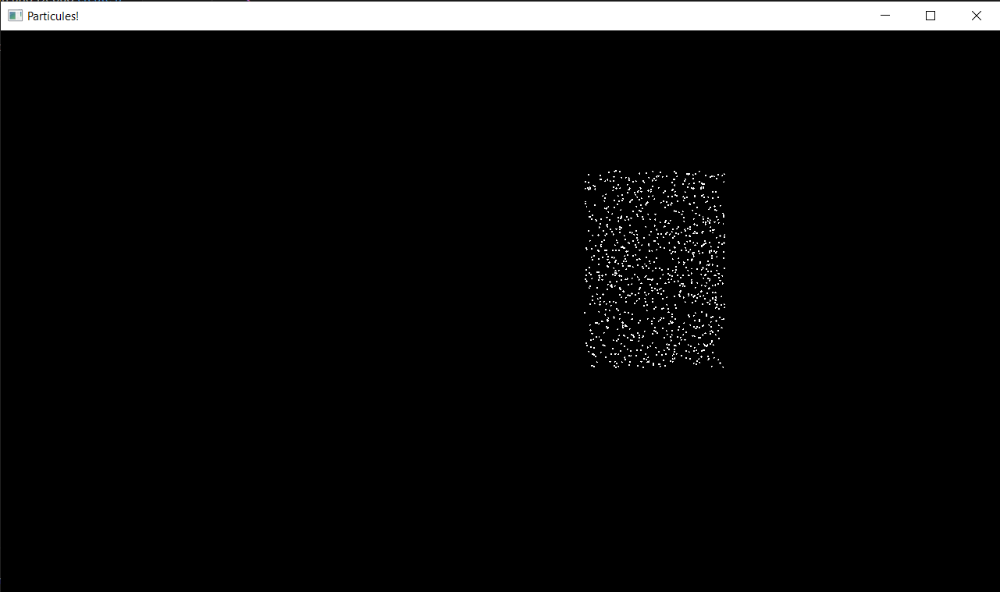
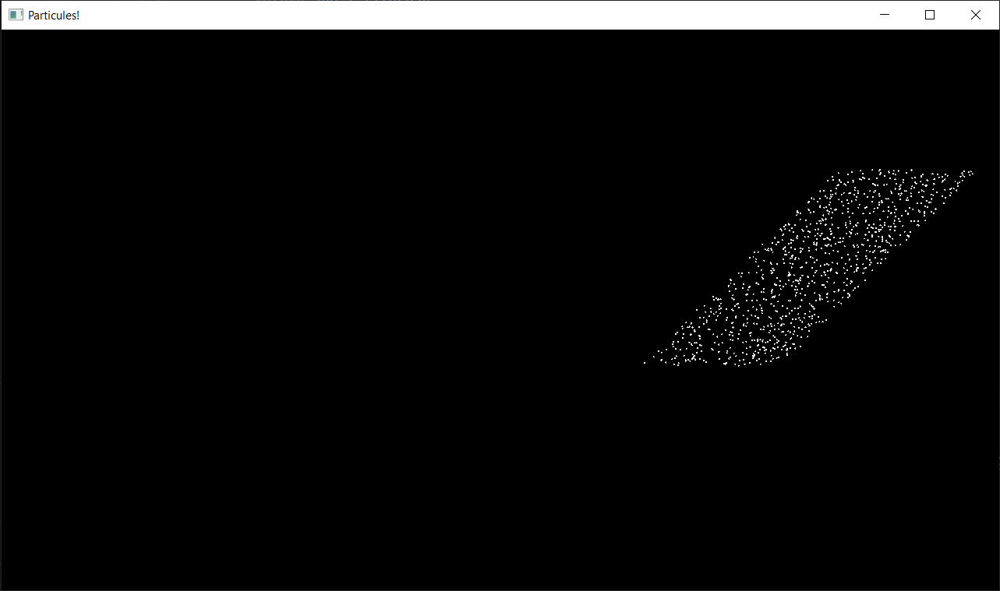
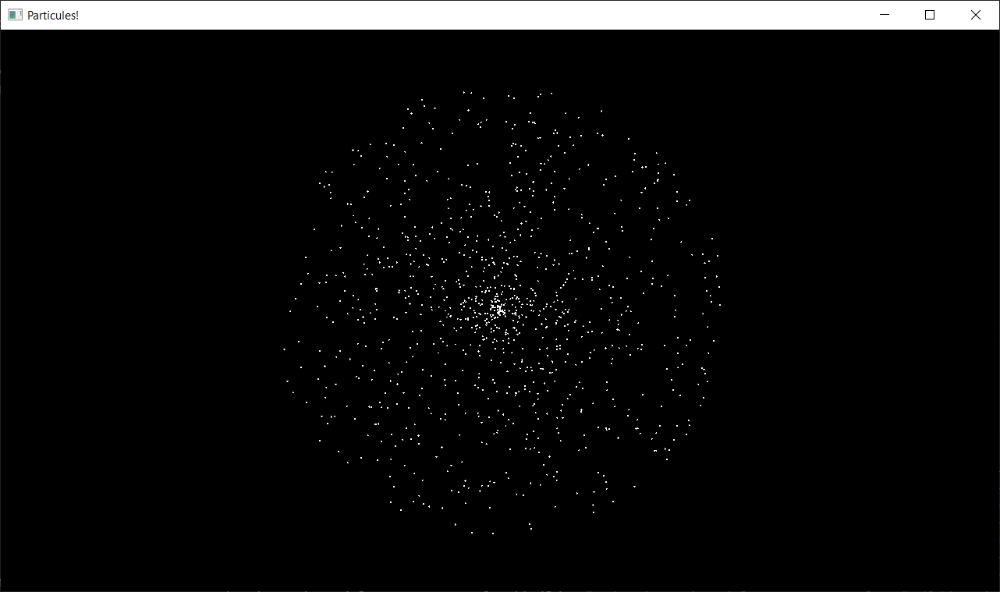
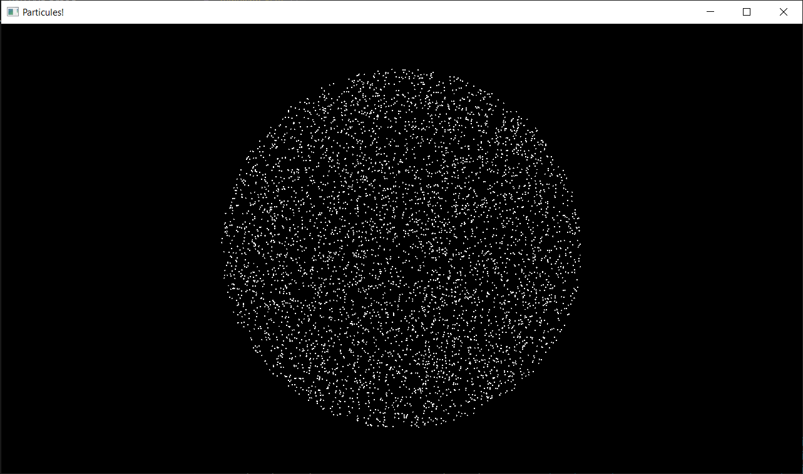
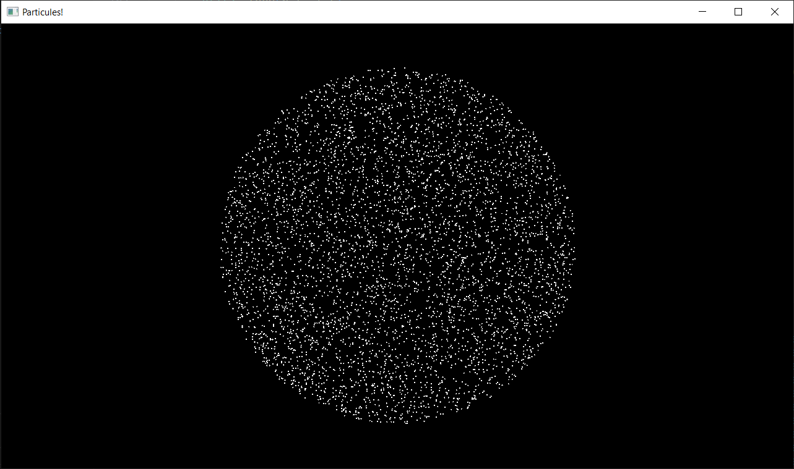

import YoutubeVideo from "/src/components/YoutubeVideo"

## Rectangle

Faites apparaître les particules au hasard dans un rectangle 
(Oui c'est facile, c'est juste l'échauffement)

:::tip
Je vous conseille de désactiver le mouvement et la durée de vie des particules, ça sera plus pratique pour observer votre distribution.
:::

## Parallélogramme

Et maintenant dans un parallélogramme

  
Aide

  
On peut définir les deux côtés du parallélogramme avec deux vecteurs, et prendre une combinaison linéaire de ces deux vecteurs avec des coefficients aléatoires entre 0 et 1. Ca nous donne un parallélogramme dont un des sommets est forcément en (0, 0), et il suffit ensuite de rajouter un offset pour le translater

## Disque

Si on choisit uniformément un angle et un rayon, on obtient une distribution qui n'est pas uniforme, où il y a plus de points au centre :

Il y a plusieurs manières de remédier à ça :

### Rejection sampling

Je vous parle de cette méthode car elle est très générique et peut s'appliquer à n'importe quelle forme, même si on va voir après que dans le cas d'un disque il existe une formule exacte qui sera bien plus rapide à calculer.

Il suffit de tirer des points uniformément dans un carré englobant le disque, et tant que le point n'est pas tombé dans le disque on recommence.

### Formule analytique

On ne veut pas que le rayon soit uniforme, mais plutôt la surface! On veut donc que `pi * r^2 = var_uniforme` (où var_uniforme est un nombre tiré uniformément aléatoirement entre 0 et la surface max du disque). Je vous laisse résoudre l'équation pour calculer `r`

## Poisson Disk Sampling

<YoutubeVideo id="7WcmyxyFO7o"/>
 

Je vous encourage à d'abord faire la version non-optimisée, sans utiliser la grille pour parcourir les voisins, et juste bêtement parcourir tous les points à chaque fois.

Puis faites la version complète, et vous pourrez constater l'énorme différence de performance
