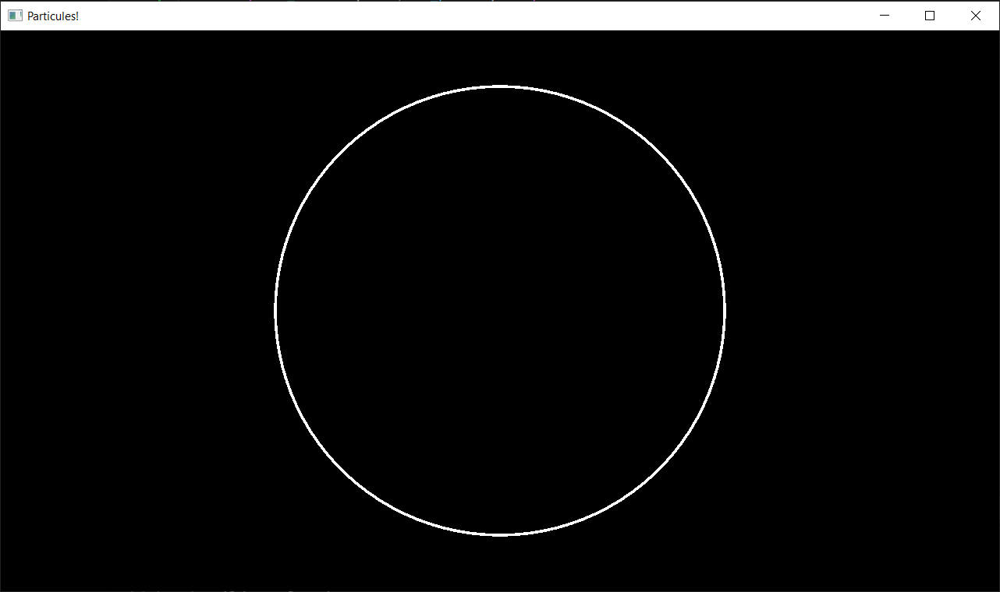
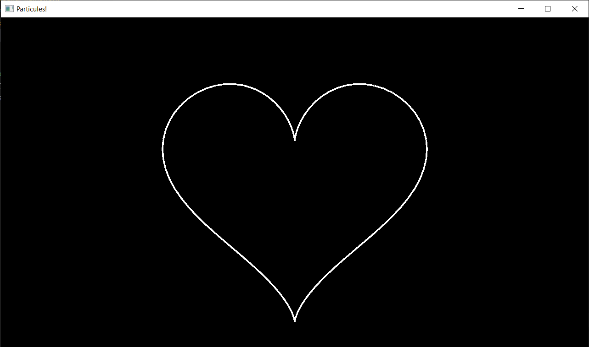
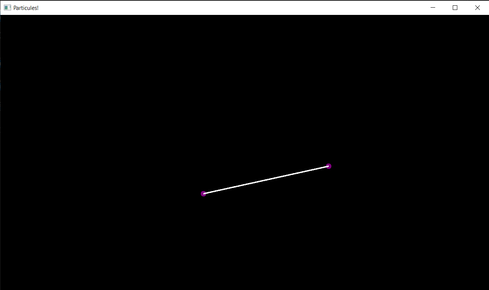
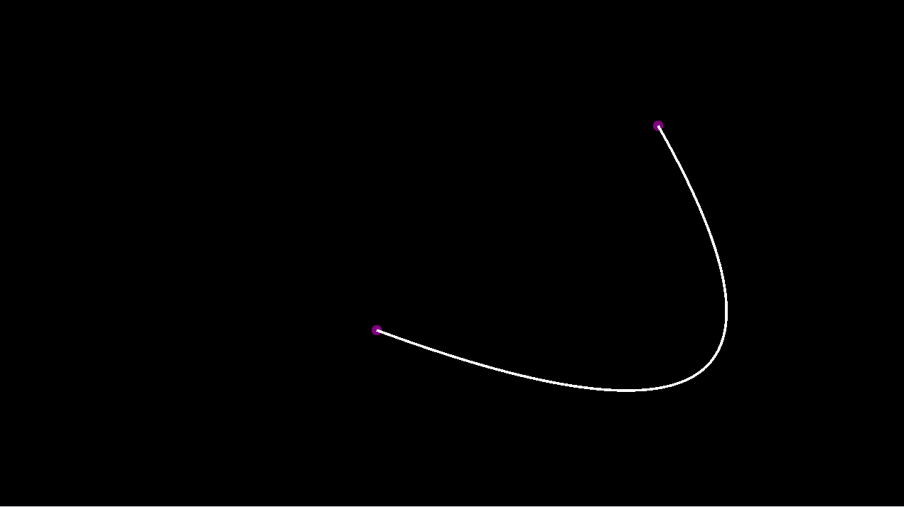
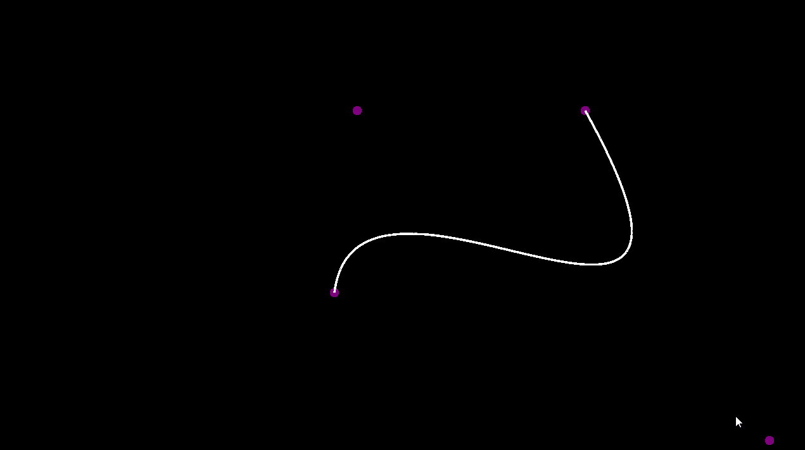
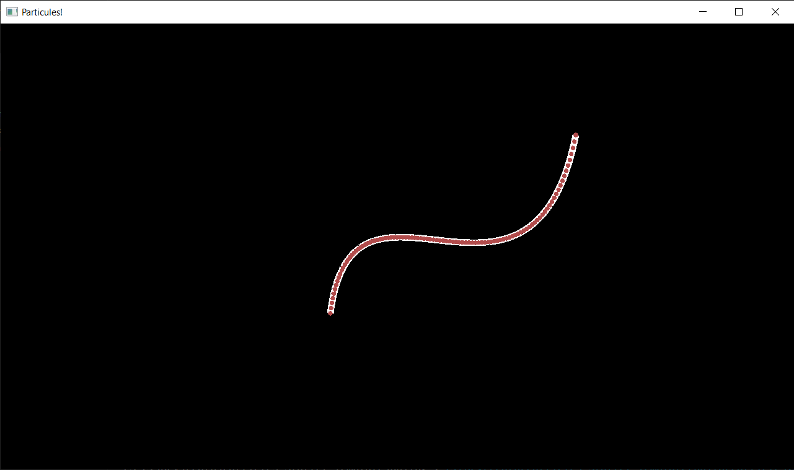
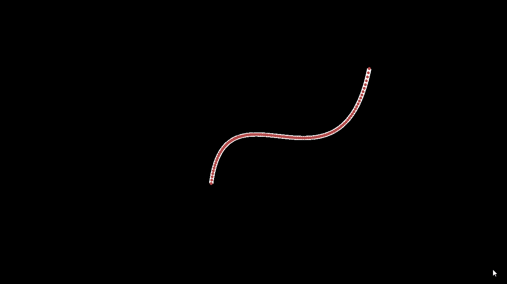
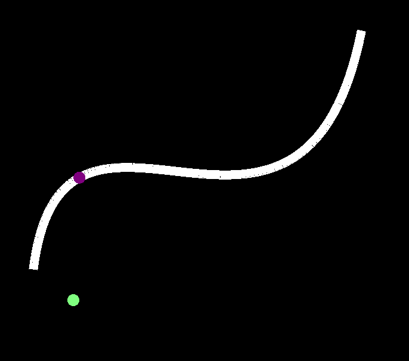
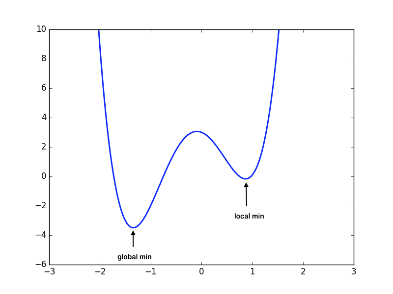
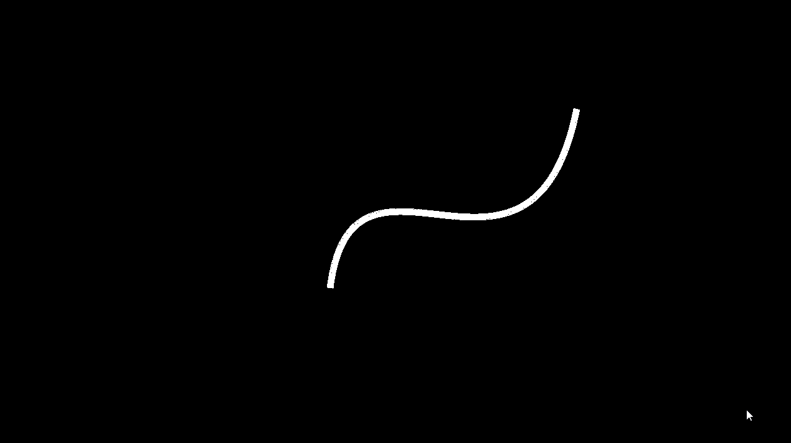

import YoutubeVideo from "/src/components/YoutubeVideo"

## Afficher une courbe paramétrique

- Faites une fonction qui prend une courbe paramétrique et l'affiche en dessinant plein de petits segments tout le long de la courbe.

:::tip
Pour passer une fonction représentant votre courbe paramétrique à la fonction de dessin, je vous conseille d'utiliser [`std::function`](https://www.geeksforgeeks.org/cpp/std-function-in-cpp/), c'est plus simple que de faire une classe abstraite et de l'héritage:

```cpp
void draw_parametric(std::function<glm::vec2(float)> /* Ceci est une fonction qui retourne un vec2 et prend en paramètre un float */ const& parametric)
{
    // ...
}

int main()
{
    draw_parametric([](float t) {
        return bezier3({-.3f, -.3f}, {-0.2f, 0.5f}, gl::mouse_position(), {.8f, .5f}, t);
    });
    // Cette syntaxe est une lambda, i.e. une fonction définie in-line dans le code:
    // la syntaxe commence par [], puis (float t) est la déclaration des paramètres de la fonction,
    // puis dans les {} on met le corp dans la fonction, comme pour une fonction normale
}
```
:::

- Testez votre fonction avec l'équation paramétrique d'un cercle, [et celle d'un coeur](https://mathworld.wolfram.com/HeartCurve.html) (attention, pas toutes les équations données sur cette page sont des équations paramétriques)



## Courbe de Bezier

- Codez des courbes de Bezier d'ordre 1, 2 et 3 avec l'algorithme de De Casteljau
- Codez des courbes de Bezier d'ordre 1, 2 et 3 avec les polynômes de Bernstein





## Particules

### Spawn

- Spawnez vos particules tout le long d'une courbe de Bezier:
  - D'abord avec un paramètre t aléatoire pour chaque particule
  
  - Puis avec des paramètres t régulièrement espacés tout le long de la courbe

(**NB:** vous remarquerez que les points sont plus rapprochés au centre, c'est parce que la courbe avance plus vite à certains endroits qu'à d'autres. Pour remédier à cela il faudrait, au lieu de faire avancer t uniformément, calculer la distance "world space" parcourue sur la courbe. On ne va pas rentrer là-dedans aujourd'hui, [mais vous pouvez le faire en bonus si vous avez fini en avance](https://youtu.be/aVwxzDHniEw?t=843))

- Maintenant, initialisez leur vitesse dans la direction de la normale à la courbe:


### Point le plus proche sur la courbe

On veut trouver le paramètre t qui minimise la distance entre bezier(t) et un point donné. Dans des cas simples on peut calculer des formules exactes, mais ce n'est pas le cas pour les courbes de Bezier et de nombreuses autres fonctions. Heureusement il existe plein d'algorithmes permettant de calculer le minimum d'une fonction.

Nous allons utiliser la descente de gradient, qui a l'avantage d'être simple à implémenter (mais n'est pas ce qui se fait de mieux en terme de performances. [La méthode de Newton-Raphson](https://en.wikipedia.org/wiki/Newton%27s_method) est bien plus rapide[^1], essayez-là en bonus si vous avez fini en avance).

Un piège avec la descente de gradient (et la méthode de Newton-Raphson a le même problème) c'est qu'on peut rester coincé sur un minimum local et ne jamais trouver le minimum global :




C'est le point de départ qui va déterminer si on trouve le vrai minimum ou pas, il faut donc le choisir "intelligemment". On peut par exemple refaire plusieurs fois l'algo avec des points de départ aléatoires, et choisir le plus petit minimum trouvé. Ou encore essayer d'abord de trouver une approximation du minimum en évaluant la fonction en un certain nombre de points, et ensuite partir de ce point là pour la descente de gradient.

[^1]: **NB:** C'est un algo pour trouver un endroit où une fonction s'annule, or nous on veut un minimum, mais pour trouver un minimum on peut chercher un endroit où la dérivée de la fonction s'annule, d'où la méthode de Newton-Raphson

### Champ de force autour de la courbe de Bezier

Maintenant qu'on sait trouver le point de la courbe de Bezier le plus proche de notre particule, on peut appliquer une force qui va dans la direction de la tangente à la courbe en ce point, et dont la force diminue plus on est loin de la courbe :

