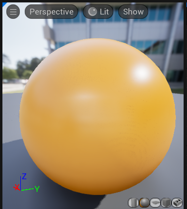
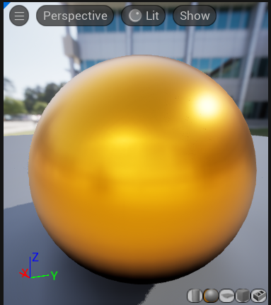
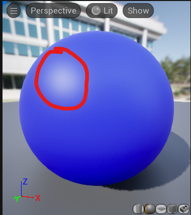
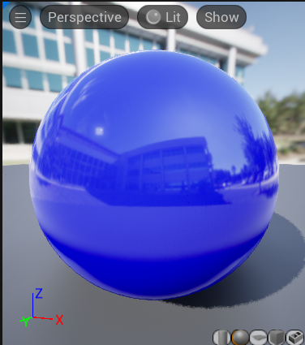
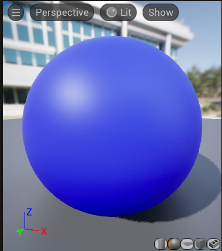
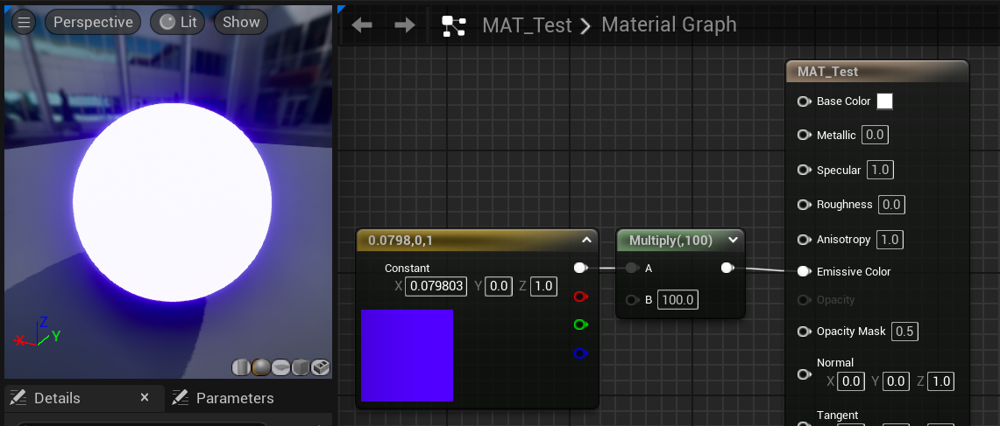
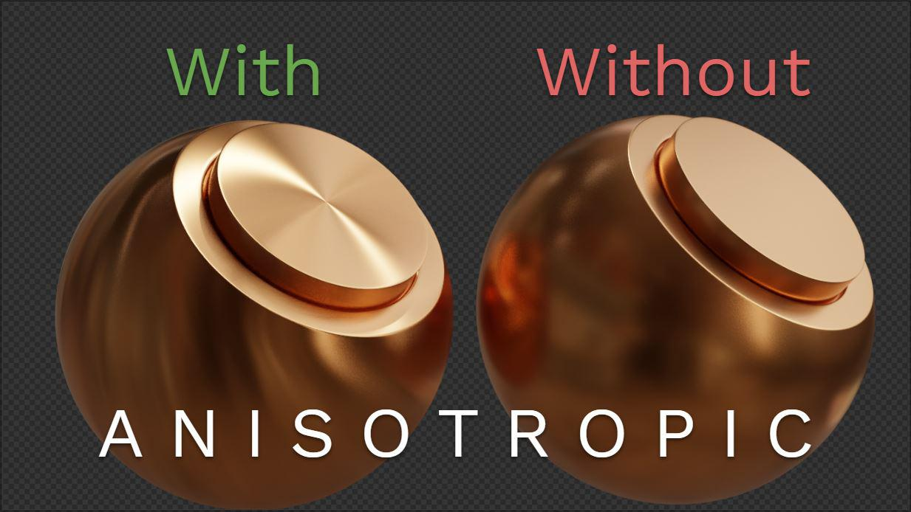
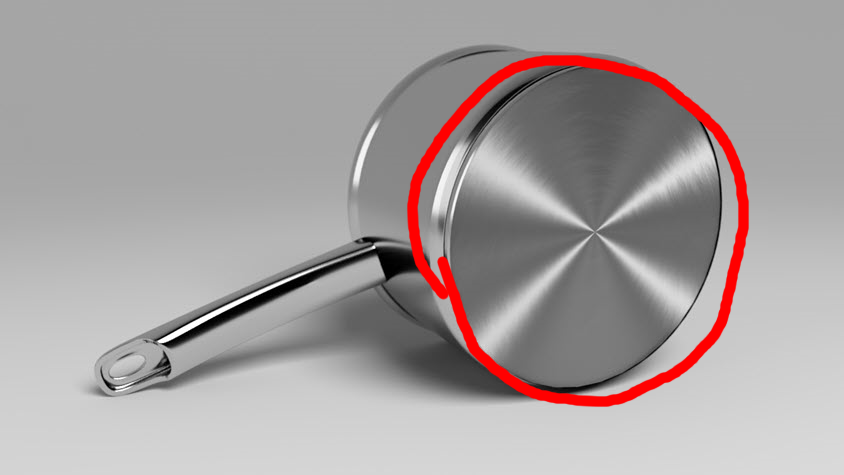

## Paramètres PBR

### `Metallic`

| 0 = non-métal | 1 = métal |
|----|-----|
|  |  |

Notez que, si on veut rester réaliste, cette valeur doit être soit à 0 soit à 1. Des valeurs intermédiaires comme 0.3 ne font pas sens physiquement (mais rien ne vous empêche de les utiliser quand même si ça produit l'effet que vous recherchez ! De nombreux styles ne sont pas physiquement réalistes et ce n'est pas un problème !)

### `Specular`

Contrôle la taille de la tache spéculaire, a.k.a. le petit reflet très lumineux :

NB : ça n'a d'effet que pour les matériaux non-métalliques.

### `Roughness`

Plus la valeur est grande, plus les réflexions sont floutées :

| Roughness 0 | Roughness 0.5 |
|----|-----|
|  |  |

### `Emissive Color`

Couleur émise par l'objet, comme si c'était une source de lumière. 
**ATTENTION**, si vous voulez que votre objet glow, il faut passer une couleur avec des valeurs supérieures à 1. Le plus simple est de choisir une couleur puis la multiplier par une intensité :

### `Anisotropy`

Nécessite d'utiliser une tangent map dans la pin Tangent.

Donne une direction aux reflections. C'est typiquement un effet qu'on voit sur les métaux brossés :

