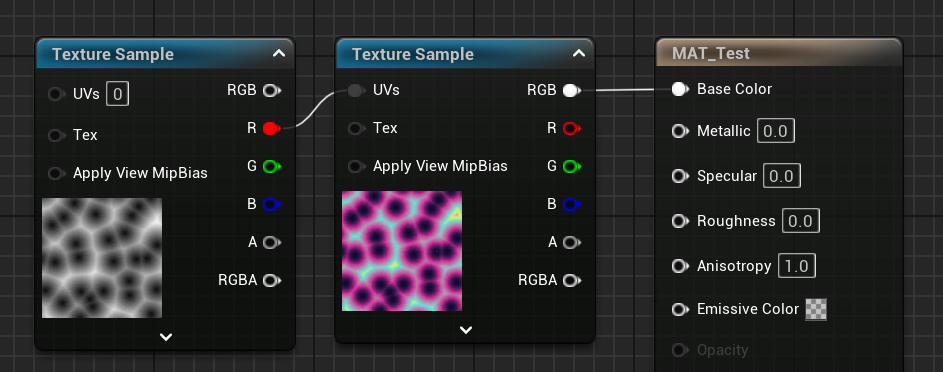

Une technique très pratique consiste à utiliser une texture pour passer un gradient de couleurs complexe au matériau. Vous pouvez générer cette texture dans l'outil de votre choix, puis l'importer dans Unreal :

On peut ensuite utiliser n'importe quel pattern en noir et blanc en tant qu'UV de la texture contenant le gradient de couleur, pour appliquer ces couleurs au pattern :

**NB :** la texture de gradient n'a besoin de faire qu'un seul pixel de haut. Quand à la largeur, c'est à vous de faire un compromis entre la qualité de la résolution et la taille de la texture.