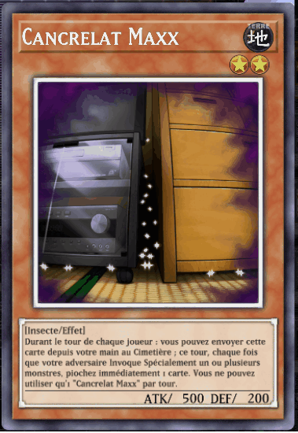

> **Faire une animation de carte brillante pour indiquer la rareté de certaines cartes**

*Carte Royale dans Yu-Gi-Oh! Master Duel, et pour comparaison, la même carte sans effet de rareté :*

Vous n'êtes pas obligé.es de produire un copier-coller de cet effet, mais je m'attend à quelque chose d'une complexité similaire (ou plus élevée ^^). Vous pouvez refaire exactement le même effet si vous le souhaitez.

Si pertinent pour votre jeu, intégrez le au projet de Studio Time. Si vous êtes plusieurs à travailler sur le même projet en studio time, faites un effet par personne, ceci est un rendu individuel.

Pour le rendu, déposez [sur ce drive](https://drive.google.com/drive/folders/17Tkjrr6jbP94sODlu5sndF1IwlKFVRru?usp=sharing), dans un dossier à votre nom, un gif / vidéo de l'effet, ainsi qu'un fichier texte contenant le lien git (vers la bonne branche !) ET LE NOM DU MATÉRIAU afin que je puisse le retrouver dans le projet. (Attention à ce que le repo soit en public, ou alors invitez moi dessus (JulesFouchy)).

**Deadline : 13 décembre à 9h45**