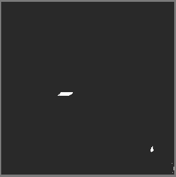
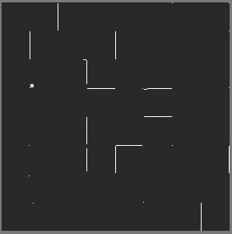

import YoutubeVideo from "/src/components/YoutubeVideo"

## Suivre un chemin quelconque

## Cases aléatoires

## Cases qui s'allument progressivement

## Utiliser l'effet précédent pour faire une transition entre deux images

## Créez vos propres effets et transitions !

Par exemple : 
<YoutubeVideo id="LnAoD7hgDxw"/>