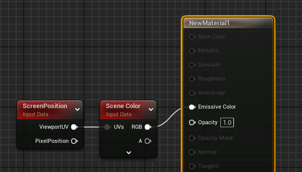
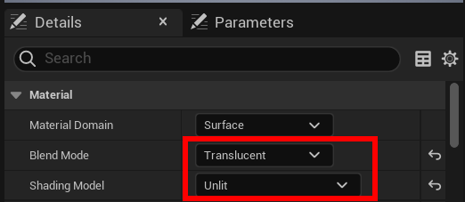

## Scene Color

On peut utiliser la texture SceneColor pour obtenir divers effets de déformation. Cette texture contient un rendu de tous les objets opaques de la scène, et est accessible aux objets transparents.

Pour sampler cette texture on utilise ScreenPosition, et c'est en déformant cette position qu'on peut obtenir divers effets.

Attention, pensez à passer votre matériau en Translucent Unlit :

