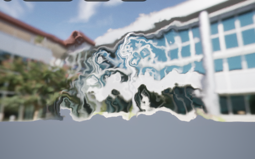

## Déformation avec du noise

NB : pour éviter une rupture abrupte sur les bords du mesh, vous pouvez utiliser un masque pour atténuer progressivement l'effet au fur et à mesure qu'on se rapproche des bords du mesh.

## Lentille

