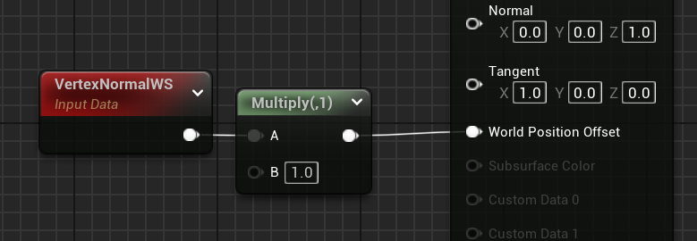
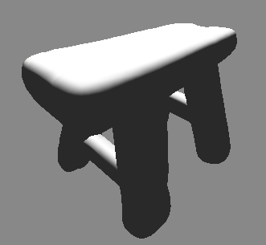
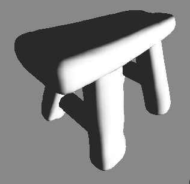

## Normales et Vertex Displacement

Pour déplacer les sommets, on va souvent vouloir le faire dans la direction de la normale, afin de s'éloigner de la surface :

En changeant ce par quoi on multiplie la normale, et en utilisant des valeurs qui changent dans l'espace et / ou le temps, avec du noise ou tout autre masque, on peut obtenir de nombreux effets.

## Masque en fonction de la normale

On peut isoler les parties du mesh qui sont orientées dans une certaine direction en mesurant à quel point la normale est alignée avec cette direction, grâce au **produit scalaire** (DotProduct). 
Pour rappel, le produit scalaire entre deux vecteurs *unitaires*[^1] vaut 1 quand ils sont parfaitement alignés, 0 quand ils sont perpendiculaires, et -1 quand ils sont parfaitement opposés. En combinant ça avec une SmoothStep on peut récupérer un masque qui indique les zones où le produit scalaire est proche de 1.

---

[^1]: *i.e.* de longueur 1 (ce qui est le cas des Normales par défaut). Si les vecteurs ne sont pas unitaires le résultat du produit scalaire sera multiplié par les longueurs des deux vecteurs.