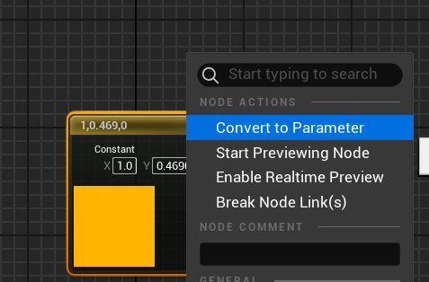
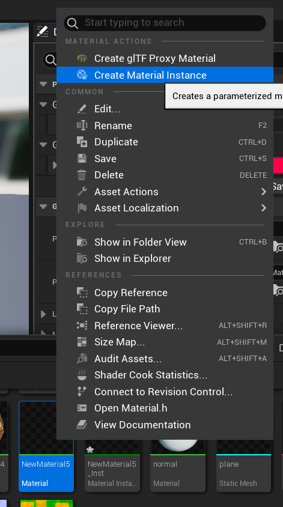
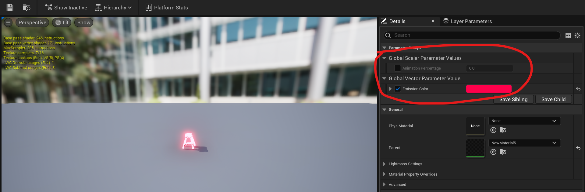
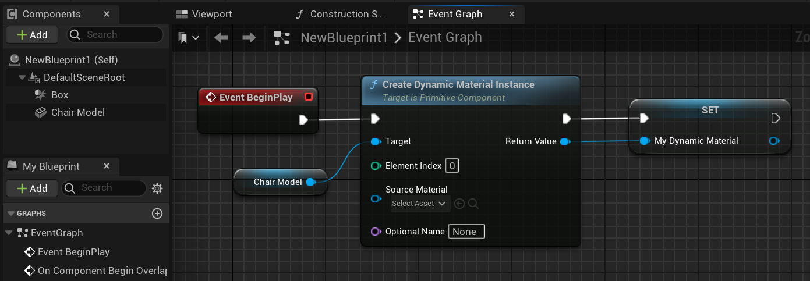
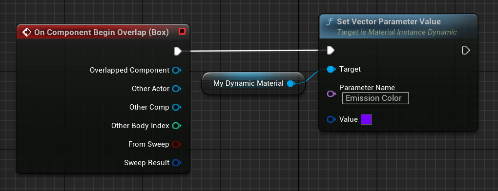

## Paramètres exposés

Il est possible d'exposer des paramètres pour qu'ils soient modifiables depuis l'éditeur et / ou depuis le code. Pour cela, au lieu d'utiliser un node `Constant`, ou va utiliser un node Parameter (`ScalarParameter`, `VectorParameter`, `TextureParameter`, etc.) 
(NB: il est aussi possible de convertir un node Constant existant en Parameter avec un clic-droit :

## Customisation statique

Si vous voulez créer une variante du matériau, qui utilise des valeurs différentes pour un ou plusieurs paramètres, et que ces valeurs **ne vont pas changer à runtime**, vous pouvez créer une *Material Instance* à partir de ce Material :

Puis sélectionner les paramètres qu'on veut changer dans cette instance :

Avoir des Material Instance permet de faire des variantes d'un matériau. C'est très performant car Unreal peut rendre tous les objets qui utilisent des Material Instance venant du même Material en une seule passe de rendu. C'est donc bien mieux que de faire différents Material qui ne diffèrent que par la valeur d'une ou deux constantes.

## Customisation dynamique

Si vous voulez pouvoir changer les paramètres à runtime, en fonction d'actions gameplay ou autre, alors il ne faut pas faire de Material Instance mais plutôt, directement depuis un script, créer un **Dynamic Material Instance** :

Puis vous pouvez quand vous voulez changer la valeur des paramètres du matériau :

