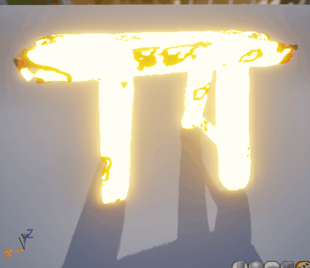

> **Reproduire cet effet**

Voici les points que vous devrez implémenter :
- Tremblement du modèle
- Disparition progressive (vous pouvez utiliser `ObjectPositionWS` pour obtenir le centre du modèle)
- Utiliser un noise pour donner des contours organiques à la disparition
- Glow, sauf sur les parties qui s'apprêtent à disparaître
- Activer cet effet depuis le gameplay (quand on s'approche de l'objet, ou quand on lui tire dessus, ou ce que vous voulez). Puis enlever l'objet de la scène quand l'effet de disparition est terminé. ([Cette vidéo peut vous aider](https://youtu.be/7S8FdUPpxUw))
  
Pour le rendu, déposez [sur ce drive](https://drive.google.com/drive/folders/17Tkjrr6jbP94sODlu5sndF1IwlKFVRru?usp=sharing), dans un dossier à votre nom, un gif / vidéo de l'effet, ainsi qu'un fichier texte contenant le lien git (vers la bonne branche !) ET LE NOM DU MATÉRIAU afin que je puisse le retrouver dans le projet. (Attention à ce que le repo soit en public, ou alors invitez moi dessus (JulesFouchy)).

**Deadline : Dimanche 22 décembre à 23h59**